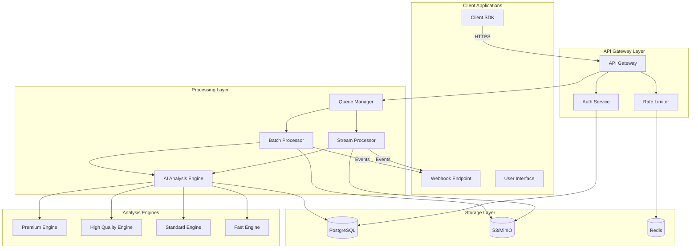

# TL;DR Highlight API - Enterprise Integration Documentation

## Executive Summary

The TL;DR Highlight API is a general-purpose, enterprise-ready service that provides AI-powered highlight extraction from livestreams and video content. Built on proven technology from TL;DR.tv's stream processing platform, this API enables businesses to automatically identify and extract compelling moments from video content using advanced AI models, chat analysis, and audio processing.

## Table of Contents

1. [Overview](#overview)
2. [Key Features](#key-features)
3. [Quick Start Guide](#quick-start-guide)
4. [Authentication](#authentication)
5. [API Endpoints](#api-endpoints)
6. [Integration Patterns](#integration-patterns)
7. [SDKs and Client Libraries](#sdks-and-client-libraries)
8. [Webhooks and Events](#webhooks-and-events)
9. [Rate Limits and Quotas](#rate-limits-and-quotas)
10. [Pricing and Billing](#pricing-and-billing)
11. [Best Practices](#best-practices)
12. [Architecture Overview](#architecture-overview)

## Overview

### What is the TL;DR Highlight API?

The TL;DR Highlight API automatically identifies and extracts highlight-worthy moments from video content using:
- **AI-powered video analysis** using state-of-the-art technology
- **Chat sentiment analysis** for livestreams with audience interaction
- **Audio transcription and analysis** for content understanding
- **Multi-modal processing** combining visual, audio, and text signals

### Use Cases

- **Gaming Platforms**: Automatically create highlight reels from gameplay streams
- **Sports Broadcasting**: Extract key moments from live sports events
- **Educational Platforms**: Identify important segments from lectures and tutorials
- **Corporate Communications**: Extract key points from meetings and presentations
- **Content Creators**: Automate highlight creation for social media

## Key Features

### 1. Real-time Stream Processing
- Process livestreams in real-time as they happen
- Low-latency highlight detection (typically within 30-60 seconds)
- Support for major streaming platforms (Twitch, YouTube, custom RTMP)

### 2. Batch Video Processing
- Upload existing videos for highlight extraction
- Process multiple videos concurrently
- Support for common video formats (MP4, MOV, AVI, MKV)

### 3. Advanced Analysis Configuration
- Configure detection sensitivity and parameters
- Customize analysis for specific use cases
- Enterprise-grade processing capabilities

### 4. Multi-modal Analysis
- Video frame analysis for visual highlights
- Audio transcription and analysis
- Chat/comment sentiment analysis (for livestreams)
- Combined scoring for accurate highlight detection

### 5. Flexible Output Options
- Multiple output formats (MP4, WebM, HLS)
- Customizable clip duration (10-120 seconds)
- Thumbnail generation
- Metadata and captions

## Quick Start Guide

### 1. Get Your API Key

```bash
# Sign up at https://api.tldr-highlight.com/signup
# Your API key will be in your dashboard
```

### 2. Install SDK (Python Example)

```bash
pip install tldr-highlight-sdk
```

### 3. Your First Highlight Request

```python
from tldr_highlight import TLDRClient

# Initialize client
client = TLDRClient(api_key="your_api_key_here")

# Start processing a livestream
stream = client.streams.create(
    url="https://twitch.tv/streamername",
    options={
        "analysis_quality": "high",
        "sensitivity": "medium",
        "clip_duration": 30
    }
)

# Check status
status = client.streams.get_status(stream.id)
print(f"Processing status: {status.state}")

# Get highlights when ready
if status.state == "completed":
    highlights = client.streams.get_highlights(stream.id)
    for highlight in highlights:
        print(f"Highlight: {highlight.title}")
        print(f"URL: {highlight.video_url}")
        print(f"Score: {highlight.confidence_score}")
```

## Authentication

### API Key Authentication

All API requests require an API key passed in the `X-API-Key` header:

```bash
curl -H "X-API-Key: your_api_key_here" \
     https://api.tldr-highlight.com/v1/streams
```

### API Key Scopes

API keys can have different scopes based on your plan:

| Scope | Description |
|-------|-------------|
| `streams.read` | Read stream processing status and results |
| `streams.write` | Create and manage stream processing tasks |
| `batch.read` | Read batch processing status and results |
| `batch.write` | Upload and manage batch processing tasks |
| `webhooks.manage` | Configure webhook endpoints |
| `billing.read` | View usage and billing information |

### Obtaining API Keys

1. **Dashboard**: Generate keys at https://dashboard.tldr-highlight.com/api-keys
2. **API**: Use the `/v1/api-keys` endpoint (requires account credentials)
3. **Enterprise**: Contact sales for dedicated keys with custom limits

## API Endpoints

### Base URL
```
https://api.tldr-highlight.com/v1
```

### Stream Processing

#### Start Stream Processing
```http
POST /v1/streams
Content-Type: application/json
X-API-Key: your_api_key

{
  "source_url": "https://twitch.tv/streamername",
  "platform": "twitch",
  "options": {
    "analysis_quality": "high",
    "sensitivity": "high",
    "clip_duration": 30,
    "include_chat": true,
    "webhook_url": "https://your-domain.com/webhook"
  }
}
```

Response:
```json
{
  "id": "str_1234567890",
  "status": "processing",
  "created_at": "2024-01-15T10:00:00Z",
  "source_url": "https://twitch.tv/streamername",
  "options": {...}
}
```

#### Get Stream Status
```http
GET /v1/streams/{stream_id}
X-API-Key: your_api_key
```

Response:
```json
{
  "id": "str_1234567890",
  "status": "processing",
  "progress": {
    "processed_duration": 3600,
    "highlights_found": 5
  },
  "created_at": "2024-01-15T10:00:00Z",
  "updated_at": "2024-01-15T11:00:00Z"
}
```

#### Get Stream Highlights
```http
GET /v1/streams/{stream_id}/highlights
X-API-Key: your_api_key
```

Response:
```json
{
  "highlights": [
    {
      "id": "hl_abc123",
      "title": "Epic Triple Kill",
      "description": "Player achieves triple elimination with sniper rifle",
      "video_url": "https://cdn.tldr-highlight.com/highlights/hl_abc123.mp4",
      "thumbnail_url": "https://cdn.tldr-highlight.com/thumbnails/hl_abc123.jpg",
      "duration": 30,
      "timestamp": 1234,
      "confidence_score": 0.95,
      "tags": ["action", "elimination", "sniper"],
      "metadata": {
        "game": "Valorant",
        "chat_activity": "high",
        "audio_peaks": true
      }
    }
  ],
  "pagination": {
    "total": 15,
    "page": 1,
    "per_page": 10
  }
}
```

### Batch Processing

#### Upload Videos for Batch Processing
```http
POST /v1/batch
Content-Type: multipart/form-data
X-API-Key: your_api_key

{
  "videos": [file1.mp4, file2.mp4],
  "options": {
    "analysis_quality": "premium",
    "sensitivity": "medium",
    "parallel_processing": true
  }
}
```

Alternative with URLs:
```http
POST /v1/batch
Content-Type: application/json
X-API-Key: your_api_key

{
  "video_urls": [
    "https://example.com/video1.mp4",
    "https://example.com/video2.mp4"
  ],
  "options": {
    "analysis_quality": "premium",
    "sensitivity": "medium"
  }
}
```

#### Get Batch Status
```http
GET /v1/batch/{batch_id}
X-API-Key: your_api_key
```

### Webhooks

#### Configure Webhook
```http
POST /v1/webhooks
Content-Type: application/json
X-API-Key: your_api_key

{
  "url": "https://your-domain.com/webhook",
  "events": ["highlight.created", "stream.completed", "batch.completed"],
  "secret": "your_webhook_secret"
}
```

## Integration Patterns

### 1. Real-time Stream Integration

**Use Case**: Process live gaming streams and create highlights in real-time

```python
import asyncio
from tldr_highlight import TLDRClient, StreamEventHandler

class MyStreamHandler(StreamEventHandler):
    async def on_highlight_detected(self, highlight):
        # Handle new highlight
        print(f"New highlight: {highlight.title}")
        # Save to your database, notify users, etc.
        
    async def on_stream_completed(self, stream, summary):
        # Handle stream completion
        print(f"Stream completed with {len(summary.highlights)} highlights")

async def process_stream():
    client = TLDRClient(api_key="your_api_key")
    
    # Start processing with event handler
    stream = await client.streams.create_async(
        url="https://twitch.tv/streamername",
        event_handler=MyStreamHandler()
    )
    
    # Keep connection alive
    await stream.wait_for_completion()

# Run the async function
asyncio.run(process_stream())
```

### 2. Batch Processing Pipeline

**Use Case**: Process uploaded videos from content creators

```python
from tldr_highlight import TLDRClient
import os

def process_video_folder(folder_path):
    client = TLDRClient(api_key="your_api_key")
    
    # Get all video files
    video_files = [
        os.path.join(folder_path, f) 
        for f in os.listdir(folder_path) 
        if f.endswith(('.mp4', '.mov'))
    ]
    
    # Create batch job
    batch = client.batch.create(
        files=video_files,
        options={
            "analysis_quality": "high",
            "parallel_processing": True,
            "max_highlights_per_video": 5
        }
    )
    
    # Poll for completion
    while batch.status != "completed":
        time.sleep(30)
        batch = client.batch.get(batch.id)
        print(f"Progress: {batch.progress}%")
    
    # Get all highlights
    highlights = client.batch.get_highlights(batch.id)
    return highlights
```

### 3. Webhook Integration

**Use Case**: Receive real-time notifications for highlight events

```python
from flask import Flask, request
import hmac
import hashlib

app = Flask(__name__)
WEBHOOK_SECRET = "your_webhook_secret"

@app.route('/webhook', methods=['POST'])
def handle_webhook():
    # Verify webhook signature
    signature = request.headers.get('X-TLDR-Signature')
    expected = hmac.new(
        WEBHOOK_SECRET.encode(),
        request.data,
        hashlib.sha256
    ).hexdigest()
    
    if not hmac.compare_digest(signature, expected):
        return "Unauthorized", 401
    
    # Process webhook event
    event = request.json
    
    if event['type'] == 'highlight.created':
        highlight = event['data']
        # Process new highlight
        save_highlight_to_database(highlight)
        notify_users(highlight)
    
    elif event['type'] == 'stream.completed':
        stream = event['data']
        # Process completed stream
        generate_summary_report(stream)
    
    return "OK", 200
```

### 4. Custom Analysis Configuration

**Use Case**: Configure specialized analysis for your content

```python
from tldr_highlight import TLDRClient, AnalysisConfig

class MyCustomConfig(AnalysisConfig):
    def __init__(self):
        # Configure analysis parameters
        self.sensitivity = "high"
        self.detection_threshold = 0.8
    
    def configure_analysis(self, content_type):
        # Custom configuration logic
        if content_type == "gaming":
            return {"focus": "action", "clip_preference": "short"}
        else:
            return {"focus": "general", "clip_preference": "medium"}

# Use custom configuration
client = TLDRClient(api_key="your_api_key")
config = MyCustomConfig()

stream = client.streams.create(
    url="https://example.com/stream",
    options={"analysis_config": config}
)
```

## SDKs and Client Libraries

### Official SDKs

| Language | Installation | Documentation |
|----------|-------------|---------------|
| Python | `pip install tldr-highlight` | [Python SDK Docs](https://docs.tldr-highlight.com/python) |
| Node.js | `npm install @tldr/highlight-sdk` | [Node.js SDK Docs](https://docs.tldr-highlight.com/nodejs) |
| Go | `go get github.com/tldr/highlight-sdk-go` | [Go SDK Docs](https://docs.tldr-highlight.com/go) |
| Java | Maven/Gradle | [Java SDK Docs](https://docs.tldr-highlight.com/java) |
| C# | NuGet | [.NET SDK Docs](https://docs.tldr-highlight.com/dotnet) |

### Python SDK Example

```python
from tldr_highlight import TLDRClient
from tldr_highlight.models import StreamOptions, BatchOptions

# Initialize client
client = TLDRClient(
    api_key="your_api_key",
    timeout=30,
    max_retries=3
)

# Stream processing with all options
stream_options = StreamOptions(
    analysis_quality="high",
    sensitivity="high",
    clip_duration=30,
    include_chat=True,
    include_audio=True,
    custom_tags=["gaming", "fps"],
    webhook_url="https://your-domain.com/webhook"
)

stream = client.streams.create(
    url="https://twitch.tv/streamername",
    options=stream_options
)

# Batch processing with progress callback
def progress_callback(progress):
    print(f"Processing: {progress.percent}% complete")

batch = client.batch.create(
    files=["video1.mp4", "video2.mp4"],
    options=BatchOptions(analysis_quality="premium"),
    progress_callback=progress_callback
)
```

### Node.js SDK Example

```javascript
const { TLDRClient } = require('@tldr/highlight-sdk');

// Initialize client
const client = new TLDRClient({
  apiKey: 'your_api_key',
  timeout: 30000,
  maxRetries: 3
});

// Stream processing
async function processStream() {
  const stream = await client.streams.create({
    url: 'https://twitch.tv/streamername',
    options: {
      analysisQuality: 'high',
      sensitivity: 'high',
      clipDuration: 30
    }
  });

  // Poll for highlights
  const highlights = await client.streams.waitForHighlights(stream.id, {
    pollInterval: 30000,
    timeout: 3600000
  });

  return highlights;
}

// Webhook handling with Express
const express = require('express');
const app = express();

app.post('/webhook', client.webhooks.handler({
  secret: 'your_webhook_secret',
  onHighlightCreated: async (highlight) => {
    console.log('New highlight:', highlight);
  },
  onStreamCompleted: async (stream) => {
    console.log('Stream completed:', stream);
  }
}));
```

## Webhooks and Events

### Event Types

| Event | Description | Payload |
|-------|-------------|---------|
| `highlight.created` | New highlight detected | Highlight object |
| `stream.started` | Stream processing started | Stream object |
| `stream.completed` | Stream processing completed | Stream object with summary |
| `stream.error` | Stream processing error | Error details |
| `batch.completed` | Batch processing completed | Batch object with results |
| `batch.error` | Batch processing error | Error details |

### Webhook Security

All webhooks include a signature header for verification:

```
X-TLDR-Signature: sha256=<signature>
X-TLDR-Timestamp: <unix_timestamp>
```

Verify webhooks using:

```python
import hmac
import hashlib

def verify_webhook(request_body, signature, timestamp, secret):
    message = f"{timestamp}.{request_body}"
    expected = hmac.new(
        secret.encode(),
        message.encode(),
        hashlib.sha256
    ).hexdigest()
    
    return hmac.compare_digest(f"sha256={expected}", signature)
```

### Retry Policy

- Webhooks are retried up to 5 times with exponential backoff
- Retry intervals: 1s, 2s, 4s, 8s, 16s
- Webhooks are considered failed after all retries are exhausted

## Rate Limits and Quotas

### Rate Limits by Plan

| Plan | Requests/Hour | Concurrent Streams | Batch Size | Storage |
|------|---------------|-------------------|------------|---------|
| Free | 100 | 1 | 5 videos | 1 GB |
| Starter | 1,000 | 5 | 20 videos | 10 GB |
| Professional | 10,000 | 20 | 100 videos | 100 GB |
| Enterprise | Unlimited | Unlimited | Unlimited | Unlimited |

### Rate Limit Headers

All responses include rate limit information:

```
X-RateLimit-Limit: 1000
X-RateLimit-Remaining: 998
X-RateLimit-Reset: 1642512000
```

### Handling Rate Limits

```python
from tldr_highlight import TLDRClient, RateLimitError
import time

client = TLDRClient(api_key="your_api_key")

def with_retry(func, *args, **kwargs):
    max_retries = 3
    retry_count = 0
    
    while retry_count < max_retries:
        try:
            return func(*args, **kwargs)
        except RateLimitError as e:
            retry_count += 1
            wait_time = e.retry_after or (2 ** retry_count)
            print(f"Rate limited. Waiting {wait_time} seconds...")
            time.sleep(wait_time)
    
    raise Exception("Max retries exceeded")

# Use with retry
stream = with_retry(client.streams.create, url="https://example.com/stream")
```

## Pricing and Billing

### Pricing Model

| Component | Free Tier | Paid Tiers |
|-----------|-----------|------------|
| API Calls | 1,000/month | $0.001 per call |
| Processing Time | 10 hours/month | $0.10 per hour |
| Storage | 1 GB | $0.02 per GB/month |
| Bandwidth | 10 GB | $0.05 per GB |
| Custom Models | Not available | $500/month |

### Usage Tracking

Monitor your usage via API:

```http
GET /v1/usage
X-API-Key: your_api_key
```

Response:
```json
{
  "period": "2024-01",
  "usage": {
    "api_calls": 45678,
    "processing_hours": 234.5,
    "storage_gb": 45.2,
    "bandwidth_gb": 123.4
  },
  "costs": {
    "api_calls": 45.68,
    "processing": 23.45,
    "storage": 0.90,
    "bandwidth": 6.17,
    "total": 76.20
  },
  "limits": {
    "api_calls": 100000,
    "processing_hours": 1000,
    "storage_gb": 100,
    "bandwidth_gb": 1000
  }
}
```

## Best Practices

### 1. Optimize API Usage

**Batch Requests When Possible**
```python
# Instead of processing videos one by one
for video in videos:
    client.batch.create(files=[video])  # Inefficient

# Process in batches
client.batch.create(files=videos)  # Efficient
```

**Use Webhooks Instead of Polling**
```python
# Inefficient polling
while True:
    status = client.streams.get(stream_id)
    if status.state == "completed":
        break
    time.sleep(30)

# Efficient webhook
client.streams.create(
    url="https://example.com/stream",
    options={"webhook_url": "https://your-domain.com/webhook"}
)
```

### 2. Error Handling

```python
from tldr_highlight import (
    TLDRClient, 
    APIError, 
    RateLimitError, 
    InvalidRequestError,
    StreamNotFoundError
)

client = TLDRClient(api_key="your_api_key")

try:
    stream = client.streams.create(url="https://example.com/stream")
except InvalidRequestError as e:
    # Handle invalid parameters
    print(f"Invalid request: {e.message}")
except RateLimitError as e:
    # Handle rate limiting
    print(f"Rate limited. Retry after: {e.retry_after}")
except StreamNotFoundError as e:
    # Handle missing stream
    print(f"Stream not found: {e.stream_id}")
except APIError as e:
    # Handle other API errors
    print(f"API error: {e.message}")
```

### 3. Performance Optimization

**Use Appropriate Analysis Settings**
- `premium`: Best quality, slower processing
- `high`: High quality, balanced performance
- `standard`: Good quality, faster processing
- `fast`: Optimized for real-time processing

**Configure Processing Options**
```python
# For real-time streams
stream_options = {
    "analysis_quality": "fast",  # Optimized for speed
    "frame_interval": 2,  # Process every 2 seconds
    "preview_mode": True  # Lower quality, faster results
}

# For high-quality batch processing
batch_options = {
    "analysis_quality": "premium",  # Best quality
    "frame_interval": 0.5,  # Process every 0.5 seconds
    "enhanced_mode": True  # Higher quality, slower
}
```

### 4. Security Best Practices

**Store API Keys Securely**
```python
# Don't hardcode API keys
client = TLDRClient(api_key="sk_live_...")  # Bad

# Use environment variables
import os
client = TLDRClient(api_key=os.environ['TLDR_API_KEY'])  # Good

# Or use a secrets manager
from aws_secretsmanager import get_secret
client = TLDRClient(api_key=get_secret('tldr-api-key'))  # Better
```

**Validate Webhook Signatures**
```python
@app.route('/webhook', methods=['POST'])
def webhook():
    if not verify_webhook_signature(request):
        return "Unauthorized", 401
    
    # Process webhook...
```

## Architecture Overview

### System Architecture



### Data Flow

1. **Client Request**: Client sends API request with authentication
2. **Validation**: API Gateway validates request and checks rate limits
3. **Queue**: Valid requests are queued for processing
4. **Processing**: Stream/Batch processor handles the request
5. **AI Analysis**: Content is analyzed using selected AI model
6. **Storage**: Results are stored in database and object storage
7. **Notification**: Client is notified via webhook or polling

### Scalability

- **Horizontal Scaling**: All components can scale horizontally
- **Auto-scaling**: Based on queue depth and CPU usage
- **Geographic Distribution**: CDN for global content delivery
- **Caching**: Redis for frequently accessed data

## Support and Resources

### Documentation
- API Reference: https://docs.tldr-highlight.com/api
- SDK Documentation: https://docs.tldr-highlight.com/sdks
- Video Tutorials: https://tldr-highlight.com/tutorials

### Support Channels
- Email: support@tldr-highlight.com
- Slack Community: https://tldr-highlight.slack.com
- Enterprise Support: enterprise@tldr-highlight.com

### Status and Monitoring
- Status Page: https://status.tldr-highlight.com
- API Health: https://api.tldr-highlight.com/health

## Appendix

### Supported Video Formats
- MP4 (H.264, H.265)
- MOV
- AVI
- MKV
- WebM
- FLV

### Supported Streaming Platforms
- Twitch
- YouTube Live
- Facebook Gaming
- Custom RTMP/HLS streams

### Analysis Quality Levels

| Level | Speed | Quality | Cost | Best For |
|-------|-------|---------|------|----------|
| Premium | Medium | Excellent | $$$ | High-quality highlights |
| High | Medium | Very Good | $$ | Professional content |
| Standard | Fast | Good | $ | Balanced performance |
| Fast | Very Fast | Acceptable | $ | Real-time processing |
| Custom | Varies | Varies | Varies | Specialized content |