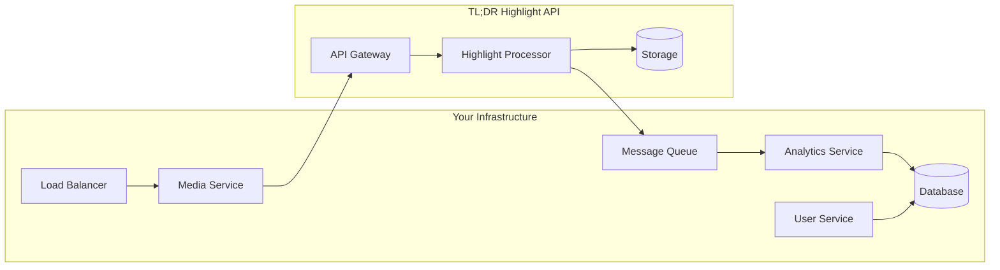

# TL;DR Highlight API - Enterprise Integration Guide

## Table of Contents

1. [Enterprise Architecture Patterns](#enterprise-architecture-patterns)
2. [Common Integration Scenarios](#common-integration-scenarios)
3. [Security Best Practices](#security-best-practices)
4. [Performance Optimization](#performance-optimization)
5. [Monitoring and Observability](#monitoring-and-observability)
6. [Disaster Recovery](#disaster-recovery)
7. [Compliance and Data Privacy](#compliance-and-data-privacy)
8. [Cost Optimization](#cost-optimization)

## Enterprise Architecture Patterns

### 1. Microservices Integration



**Implementation Example:**

```python
# media_service.py
import asyncio
from typing import Dict, Any
import aiohttp
from aiokafka import AIOKafkaProducer
import json

class MediaService:
    def __init__(self, tldr_api_key: str, kafka_config: Dict[str, Any]):
        self.tldr_api_key = tldr_api_key
        self.tldr_base_url = "https://api.tldr-highlight.com/v1"
        self.kafka_producer = AIOKafkaProducer(**kafka_config)
        
    async def process_user_stream(self, user_id: str, stream_url: str):
        """Process user's stream and publish highlights to Kafka"""
        # Start TL;DR processing
        stream_id = await self._start_tldr_processing(stream_url)
        
        # Store mapping in your database
        await self._store_stream_mapping(user_id, stream_id)
        
        # Monitor for highlights
        asyncio.create_task(
            self._monitor_highlights(user_id, stream_id)
        )
        
        return stream_id
    
    async def _start_tldr_processing(self, stream_url: str) -> str:
        """Start processing with TL;DR API"""
        async with aiohttp.ClientSession() as session:
            headers = {"X-API-Key": self.tldr_api_key}
            payload = {
                "source_url": stream_url,
                "options": {
                    "analysis_quality": "high",
                    "webhook_url": "https://your-api.com/webhooks/tldr"
                }
            }
            
            async with session.post(
                f"{self.tldr_base_url}/streams",
                json=payload,
                headers=headers
            ) as response:
                data = await response.json()
                return data["id"]
    
    async def _monitor_highlights(self, user_id: str, stream_id: str):
        """Poll for highlights and publish to Kafka"""
        while True:
            highlights = await self._get_highlights(stream_id)
            
            for highlight in highlights:
                # Publish to Kafka for analytics
                await self.kafka_producer.send(
                    "highlights",
                    value=json.dumps({
                        "user_id": user_id,
                        "highlight": highlight,
                        "timestamp": time.time()
                    }).encode()
                )
            
            # Check if processing is complete
            status = await self._get_stream_status(stream_id)
            if status["status"] in ["completed", "error"]:
                break
                
            await asyncio.sleep(30)
```

### 2. Event-Driven Architecture

```python
# webhook_handler.py
from fastapi import FastAPI, Request, HTTPException
import hmac
import hashlib
from sqlalchemy.orm import Session
from celery import Celery

app = FastAPI()
celery_app = Celery("tasks", broker="redis://localhost:6379")

WEBHOOK_SECRET = "your_webhook_secret"

@app.post("/webhooks/tldr")
async def handle_tldr_webhook(request: Request):
    """Handle webhooks from TL;DR API"""
    # Verify webhook signature
    signature = request.headers.get("X-TLDR-Signature")
    body = await request.body()
    
    if not verify_signature(body, signature, WEBHOOK_SECRET):
        raise HTTPException(status_code=401, detail="Invalid signature")
    
    # Parse event
    event = await request.json()
    
    # Route to appropriate handler
    if event["type"] == "highlight.created":
        celery_app.send_task(
            "tasks.process_highlight",
            args=[event["data"]]
        )
    elif event["type"] == "stream.completed":
        celery_app.send_task(
            "tasks.process_stream_completion",
            args=[event["data"]]
        )
    
    return {"status": "ok"}

def verify_signature(body: bytes, signature: str, secret: str) -> bool:
    """Verify webhook signature"""
    expected = hmac.new(
        secret.encode(),
        body,
        hashlib.sha256
    ).hexdigest()
    
    return hmac.compare_digest(f"sha256={expected}", signature)

# tasks.py
@celery_app.task
def process_highlight(highlight_data):
    """Process new highlight"""
    # Update your database
    db.add_highlight(highlight_data)
    
    # Trigger notifications
    notify_users(highlight_data)
    
    # Update analytics
    analytics.track_highlight(highlight_data)
    
    # Generate thumbnail variants
    generate_thumbnails(highlight_data["thumbnail_url"])

@celery_app.task
def process_stream_completion(stream_data):
    """Process completed stream"""
    # Generate summary report
    report = generate_stream_report(stream_data)
    
    # Send notifications
    send_completion_email(stream_data["user_id"], report)
    
    # Archive stream data
    archive_stream(stream_data)
```

### 3. API Gateway Pattern

```python
# api_gateway.py
from fastapi import FastAPI, Depends, HTTPException
from typing import Optional
import httpx
import redis
import json

app = FastAPI()
redis_client = redis.Redis(host='localhost', port=6379, decode_responses=True)

class TLDRGateway:
    """Gateway for TL;DR API with caching and circuit breaker"""
    
    def __init__(self):
        self.base_url = "https://api.tldr-highlight.com/v1"
        self.api_key = "your_api_key"
        self.circuit_breaker = CircuitBreaker()
        
    async def create_stream(self, request_data: dict) -> dict:
        """Create stream with caching"""
        # Check if we've processed this URL recently
        cache_key = f"stream:url:{request_data['source_url']}"
        cached = redis_client.get(cache_key)
        
        if cached:
            return json.loads(cached)
        
        # Call TL;DR API with circuit breaker
        result = await self.circuit_breaker.call(
            self._create_stream,
            request_data
        )
        
        # Cache result
        redis_client.setex(
            cache_key,
            3600,  # 1 hour
            json.dumps(result)
        )
        
        return result
    
    async def _create_stream(self, request_data: dict) -> dict:
        """Internal method to create stream"""
        async with httpx.AsyncClient() as client:
            response = await client.post(
                f"{self.base_url}/streams",
                json=request_data,
                headers={"X-API-Key": self.api_key},
                timeout=30.0
            )
            response.raise_for_status()
            return response.json()

class CircuitBreaker:
    """Circuit breaker implementation"""
    
    def __init__(self, failure_threshold=5, timeout=60):
        self.failure_threshold = failure_threshold
        self.timeout = timeout
        self.failures = 0
        self.last_failure_time = None
        self.state = "closed"  # closed, open, half-open
        
    async def call(self, func, *args, **kwargs):
        if self.state == "open":
            if time.time() - self.last_failure_time > self.timeout:
                self.state = "half-open"
            else:
                raise HTTPException(
                    status_code=503,
                    detail="Service temporarily unavailable"
                )
        
        try:
            result = await func(*args, **kwargs)
            if self.state == "half-open":
                self.state = "closed"
                self.failures = 0
            return result
        except Exception as e:
            self.failures += 1
            self.last_failure_time = time.time()
            
            if self.failures >= self.failure_threshold:
                self.state = "open"
            
            raise e

# Dependency injection
gateway = TLDRGateway()

@app.post("/api/streams")
async def create_stream(
    request: dict,
    gateway: TLDRGateway = Depends(lambda: gateway)
):
    """Create stream through gateway"""
    return await gateway.create_stream(request)
```

## Common Integration Scenarios

### 1. Gaming Platform Integration

**Use Case**: Automatically generate highlights from gaming streams

```python
# gaming_platform_integration.py
import asyncio
from datetime import datetime, timedelta
from typing import List, Dict, Any

class GamingPlatformIntegration:
    """Integration for gaming platforms"""
    
    def __init__(self, tldr_client, game_db, notification_service):
        self.tldr = tldr_client
        self.game_db = game_db
        self.notifications = notification_service
        
    async def process_tournament_stream(
        self,
        tournament_id: str,
        stream_url: str,
        game: str
    ):
        """Process tournament stream with game-specific settings"""
        # Get game-specific AI settings
        ai_settings = self.get_game_settings(game)
        
        # Start processing with custom options
        stream = await self.tldr.streams.create(
            url=stream_url,
            options={
                "analysis_quality": ai_settings["quality"],
                "sensitivity": ai_settings["sensitivity"],
                "clip_duration": ai_settings["clip_duration"],
                "custom_tags": [game, "tournament", tournament_id],
                "webhook_url": f"https://api.yourplatform.com/webhooks/tournament/{tournament_id}"
            },
            metadata={
                "tournament_id": tournament_id,
                "game": game,
                "platform": "gaming"
            }
        )
        
        # Monitor for real-time highlights
        asyncio.create_task(
            self.monitor_tournament_highlights(tournament_id, stream.id)
        )
        
        return stream.id
    
    def get_game_settings(self, game: str) -> Dict[str, Any]:
        """Get optimized settings per game"""
        game_settings = {
            "valorant": {
                "quality": "high",
                "sensitivity": "high",
                "clip_duration": 20,
                "keywords": ["ace", "clutch", "flick", "headshot"]
            },
            "league_of_legends": {
                "quality": "premium",
                "sensitivity": "medium",
                "clip_duration": 30,
                "keywords": ["pentakill", "baron", "steal", "outplay"]
            },
            "fortnite": {
                "quality": "standard",
                "sensitivity": "medium",
                "clip_duration": 25,
                "keywords": ["victory royale", "elimination", "build"]
            }
        }
        
        return game_settings.get(
            game.lower(),
            {"quality": "high", "sensitivity": "medium", "clip_duration": 30}
        )
    
    async def monitor_tournament_highlights(
        self,
        tournament_id: str,
        stream_id: str
    ):
        """Monitor and process tournament highlights in real-time"""
        processed_highlights = set()
        
        while True:
            # Get latest highlights
            highlights = await self.tldr.streams.get_highlights(stream_id)
            
            for highlight in highlights:
                if highlight.id not in processed_highlights:
                    # Process new highlight
                    await self.process_tournament_highlight(
                        tournament_id,
                        highlight
                    )
                    processed_highlights.add(highlight.id)
            
            # Check if stream is complete
            stream = await self.tldr.streams.get(stream_id)
            if stream.status == "completed":
                # Generate tournament summary
                await self.generate_tournament_summary(
                    tournament_id,
                    highlights
                )
                break
            
            await asyncio.sleep(30)
    
    async def process_tournament_highlight(
        self,
        tournament_id: str,
        highlight: Any
    ):
        """Process individual tournament highlight"""
        # Store in tournament database
        await self.game_db.add_tournament_highlight({
            "tournament_id": tournament_id,
            "highlight_id": highlight.id,
            "title": highlight.title,
            "video_url": highlight.video_url,
            "timestamp": highlight.timestamp,
            "score": highlight.confidence_score
        })
        
        # Send real-time notification
        await self.notifications.send_tournament_update(
            tournament_id,
            f"New highlight: {highlight.title}"
        )
        
        # Update live dashboard
        await self.update_tournament_dashboard(tournament_id, highlight)
```

### 2. Educational Platform Integration

**Use Case**: Extract key moments from lectures and tutorials

```python
# educational_platform_integration.py
from typing import List, Optional
import re

class EducationalPlatformIntegration:
    """Integration for educational content"""
    
    def __init__(self, tldr_client, course_db, transcript_service):
        self.tldr = tldr_client
        self.course_db = course_db
        self.transcripts = transcript_service
        
    async def process_lecture(
        self,
        course_id: str,
        lecture_url: str,
        instructor_id: str,
        topics: List[str]
    ):
        """Process lecture with educational focus"""
        # Create custom prompt for educational content
        stream = await self.tldr.streams.create(
            url=lecture_url,
            options={
                "analysis_quality": "premium",  # Best for educational content
                "sensitivity": "low",  # Focus on significant moments
                "clip_duration": 60,  # Longer clips for context
                "include_audio": True,  # Important for lectures
                "custom_tags": ["education", course_id] + topics,
                "webhook_url": f"https://edu.platform.com/webhooks/lecture/{course_id}"
            },
            metadata={
                "course_id": course_id,
                "instructor_id": instructor_id,
                "topics": topics,
                "type": "lecture"
            }
        )
        
        return stream.id
    
    async def process_lecture_highlights(
        self,
        course_id: str,
        stream_id: str
    ):
        """Process highlights with educational context"""
        # Wait for completion
        stream = await self.tldr.streams.wait_for_completion(stream_id)
        highlights = await self.tldr.streams.get_highlights(stream_id)
        
        # Process each highlight
        lecture_segments = []
        
        for highlight in highlights:
            # Get transcript for this segment
            transcript = await self.transcripts.get_segment_transcript(
                video_url=highlight.video_url,
                start_time=highlight.timestamp,
                duration=highlight.duration
            )
            
            # Extract key concepts
            concepts = self.extract_concepts(transcript)
            
            # Create educational segment
            segment = {
                "course_id": course_id,
                "highlight_id": highlight.id,
                "title": self.generate_educational_title(highlight, concepts),
                "video_url": highlight.video_url,
                "transcript": transcript,
                "concepts": concepts,
                "timestamp": highlight.timestamp,
                "duration": highlight.duration
            }
            
            lecture_segments.append(segment)
            
            # Store in course database
            await self.course_db.add_lecture_segment(segment)
        
        # Generate chapter markers
        chapters = self.generate_chapters(lecture_segments)
        await self.course_db.update_lecture_chapters(course_id, chapters)
        
        return lecture_segments
    
    def extract_concepts(self, transcript: str) -> List[str]:
        """Extract key concepts from transcript"""
        # Simple keyword extraction (in production, use NLP)
        keywords = []
        
        # Look for definitions
        definition_patterns = [
            r"(?:is defined as|means|refers to)\s+(.+?)(?:\.|,)",
            r"(?:The concept of|The idea of)\s+(.+?)(?:\s+is|,)"
        ]
        
        for pattern in definition_patterns:
            matches = re.findall(pattern, transcript, re.IGNORECASE)
            keywords.extend(matches)
        
        return list(set(keywords))
    
    def generate_educational_title(
        self,
        highlight: Any,
        concepts: List[str]
    ) -> str:
        """Generate educational title for segment"""
        if concepts:
            return f"Key Concept: {concepts[0]}"
        elif "introduction" in highlight.title.lower():
            return "Introduction to Topic"
        elif "example" in highlight.title.lower():
            return "Practical Example"
        elif "summary" in highlight.title.lower():
            return "Topic Summary"
        else:
            return highlight.title
    
    def generate_chapters(
        self,
        segments: List[Dict[str, Any]]
    ) -> List[Dict[str, Any]]:
        """Generate chapter markers for video player"""
        chapters = []
        
        for i, segment in enumerate(segments):
            chapter = {
                "index": i,
                "title": segment["title"],
                "start_time": segment["timestamp"],
                "end_time": segment["timestamp"] + segment["duration"],
                "concepts": segment["concepts"]
            }
            chapters.append(chapter)
        
        return chapters
```

### 3. Corporate Meeting Integration

**Use Case**: Extract action items and key decisions from meetings

```python
# corporate_meeting_integration.py
from datetime import datetime
import json

class CorporateMeetingIntegration:
    """Integration for corporate meetings and presentations"""
    
    def __init__(self, tldr_client, meeting_db, calendar_service):
        self.tldr = tldr_client
        self.meeting_db = meeting_db
        self.calendar = calendar_service
        
    async def process_meeting(
        self,
        meeting_id: str,
        recording_url: str,
        attendees: List[str],
        agenda: Optional[str] = None
    ):
        """Process meeting recording with business focus"""
        # Configure for meeting analysis
        stream = await self.tldr.streams.create(
            url=recording_url,
            options={
                "analysis_quality": "premium",
                "sensitivity": "low",  # Focus on significant moments
                "clip_duration": 45,  # Longer clips for context
                "include_audio": True,  # Critical for meetings
                "frame_interval": 5.0,  # Less frequent for talking heads
                "custom_tags": ["meeting", "corporate", meeting_id]
            },
            metadata={
                "meeting_id": meeting_id,
                "attendees": attendees,
                "agenda": agenda,
                "date": datetime.now().isoformat()
            }
        )
        
        # Process when complete
        await self.process_meeting_highlights(meeting_id, stream.id)
        
        return stream.id
    
    async def process_meeting_highlights(
        self,
        meeting_id: str,
        stream_id: str
    ):
        """Extract actionable insights from meeting"""
        # Get completed stream
        stream = await self.tldr.streams.wait_for_completion(stream_id)
        highlights = await self.tldr.streams.get_highlights(stream_id)
        
        # Categorize highlights
        action_items = []
        decisions = []
        key_discussions = []
        
        for highlight in highlights:
            # Analyze highlight content
            category = self.categorize_meeting_moment(highlight)
            
            if category == "action_item":
                action_items.append({
                    "description": highlight.title,
                    "timestamp": highlight.timestamp,
                    "assigned_to": self.extract_assignee(highlight.description),
                    "due_date": self.extract_due_date(highlight.description)
                })
            elif category == "decision":
                decisions.append({
                    "decision": highlight.title,
                    "context": highlight.description,
                    "timestamp": highlight.timestamp
                })
            else:
                key_discussions.append({
                    "topic": highlight.title,
                    "summary": highlight.description,
                    "timestamp": highlight.timestamp
                })
        
        # Generate meeting summary
        summary = {
            "meeting_id": meeting_id,
            "date": datetime.now().isoformat(),
            "duration": stream.progress.get("processed_duration", 0),
            "action_items": action_items,
            "decisions": decisions,
            "key_discussions": key_discussions,
            "highlight_count": len(highlights)
        }
        
        # Store summary
        await self.meeting_db.store_meeting_summary(summary)
        
        # Create follow-up tasks
        await self.create_follow_up_tasks(action_items)
        
        # Send summary email
        await self.send_meeting_summary(meeting_id, summary)
        
        return summary
    
    def categorize_meeting_moment(self, highlight: Any) -> str:
        """Categorize meeting highlight"""
        title_lower = highlight.title.lower()
        desc_lower = highlight.description.lower()
        
        action_keywords = ["action item", "will do", "assigned to", "by next", "follow up"]
        decision_keywords = ["decided", "agreed", "conclusion", "approve", "reject"]
        
        if any(keyword in title_lower or keyword in desc_lower for keyword in action_keywords):
            return "action_item"
        elif any(keyword in title_lower or keyword in desc_lower for keyword in decision_keywords):
            return "decision"
        else:
            return "discussion"
```

## Security Best Practices

### 1. API Key Management

```python
# secure_api_key_manager.py
import os
from cryptography.fernet import Fernet
from typing import Optional
import boto3
from azure.keyvault.secrets import SecretClient
from google.cloud import secretmanager

class SecureAPIKeyManager:
    """Secure API key management for enterprise"""
    
    def __init__(self, provider: str = "aws"):
        self.provider = provider
        self._init_provider()
    
    def _init_provider(self):
        """Initialize secret management provider"""
        if self.provider == "aws":
            self.client = boto3.client('secretsmanager')
        elif self.provider == "azure":
            self.client = SecretClient(
                vault_url=os.environ["AZURE_VAULT_URL"],
                credential=DefaultAzureCredential()
            )
        elif self.provider == "gcp":
            self.client = secretmanager.SecretManagerServiceClient()
        else:
            # Local encryption fallback
            self.fernet = Fernet(os.environ["ENCRYPTION_KEY"].encode())
    
    async def get_api_key(self, key_name: str = "tldr_api_key") -> str:
        """Retrieve API key from secure storage"""
        if self.provider == "aws":
            response = self.client.get_secret_value(SecretId=key_name)
            return response['SecretString']
        elif self.provider == "azure":
            return self.client.get_secret(key_name).value
        elif self.provider == "gcp":
            name = f"projects/{os.environ['GCP_PROJECT']}/secrets/{key_name}/versions/latest"
            response = self.client.access_secret_version(request={"name": name})
            return response.payload.data.decode("UTF-8")
        else:
            # Local encrypted storage
            with open(f".secrets/{key_name}.enc", "rb") as f:
                encrypted = f.read()
            return self.fernet.decrypt(encrypted).decode()
    
    async def rotate_api_key(self) -> str:
        """Rotate API key"""
        # Generate new API key from TL;DR API
        new_key = await self.generate_new_api_key()
        
        # Store new key
        await self.store_api_key(new_key)
        
        # Update all services
        await self.update_services_with_new_key(new_key)
        
        # Revoke old key after grace period
        await self.schedule_key_revocation()
        
        return new_key
```

### 2. Request Signing

```python
# request_signing.py
import time
import hmac
import hashlib
from typing import Dict, Any
import httpx

class SignedTLDRClient:
    """TL;DR client with request signing"""
    
    def __init__(self, api_key: str, signing_secret: str):
        self.api_key = api_key
        self.signing_secret = signing_secret
        self.base_url = "https://api.tldr-highlight.com/v1"
    
    def _sign_request(self, method: str, path: str, body: str = "") -> Dict[str, str]:
        """Generate request signature"""
        timestamp = str(int(time.time()))
        message = f"{method}\n{path}\n{timestamp}\n{body}"
        
        signature = hmac.new(
            self.signing_secret.encode(),
            message.encode(),
            hashlib.sha256
        ).hexdigest()
        
        return {
            "X-API-Key": self.api_key,
            "X-Timestamp": timestamp,
            "X-Signature": signature
        }
    
    async def create_stream(self, request_data: Dict[str, Any]) -> Dict[str, Any]:
        """Create stream with signed request"""
        path = "/streams"
        body = json.dumps(request_data)
        headers = self._sign_request("POST", path, body)
        
        async with httpx.AsyncClient() as client:
            response = await client.post(
                f"{self.base_url}{path}",
                content=body,
                headers={
                    **headers,
                    "Content-Type": "application/json"
                }
            )
            response.raise_for_status()
            return response.json()
```

### 3. End-to-End Encryption

```python
# e2e_encryption.py
from cryptography.hazmat.primitives import hashes
from cryptography.hazmat.primitives.asymmetric import rsa, padding
from cryptography.hazmat.primitives import serialization
import base64

class E2EEncryptedClient:
    """Client with end-to-end encryption for sensitive content"""
    
    def __init__(self, tldr_client, private_key_path: str):
        self.tldr = tldr_client
        self.private_key = self._load_private_key(private_key_path)
        self.public_key = self.private_key.public_key()
    
    def _load_private_key(self, path: str):
        """Load private key from file"""
        with open(path, "rb") as f:
            return serialization.load_pem_private_key(
                f.read(),
                password=None
            )
    
    async def process_sensitive_content(
        self,
        content_url: str,
        encryption_key: bytes
    ):
        """Process sensitive content with encryption"""
        # Encrypt the URL and metadata
        encrypted_url = self._encrypt_data(content_url.encode(), encryption_key)
        
        # Create secure processing request
        stream = await self.tldr.streams.create(
            url="https://secure-proxy.company.com/encrypted",
            options={
                "analysis_quality": "high",
                "custom_headers": {
                    "X-Encrypted-URL": base64.b64encode(encrypted_url).decode(),
                    "X-Encryption-Key": base64.b64encode(
                        self._encrypt_key(encryption_key)
                    ).decode()
                }
            }
        )
        
        # Monitor for encrypted highlights
        return await self._monitor_encrypted_highlights(stream.id, encryption_key)
    
    def _encrypt_data(self, data: bytes, key: bytes) -> bytes:
        """Encrypt data using AES"""
        from cryptography.hazmat.primitives.ciphers import Cipher, algorithms, modes
        
        iv = os.urandom(16)
        cipher = Cipher(algorithms.AES(key), modes.CBC(iv))
        encryptor = cipher.encryptor()
        
        # Pad data to multiple of 16
        padded_data = data + b' ' * (16 - len(data) % 16)
        
        encrypted = encryptor.update(padded_data) + encryptor.finalize()
        return iv + encrypted
    
    def _encrypt_key(self, key: bytes) -> bytes:
        """Encrypt AES key with RSA public key"""
        return self.public_key.encrypt(
            key,
            padding.OAEP(
                mgf=padding.MGF1(algorithm=hashes.SHA256()),
                algorithm=hashes.SHA256(),
                label=None
            )
        )
```

## Performance Optimization

### 1. Batch Processing Optimization

```python
# batch_optimization.py
import asyncio
from typing import List, Dict, Any
import concurrent.futures

class OptimizedBatchProcessor:
    """Optimized batch processing for large volumes"""
    
    def __init__(self, tldr_client, max_concurrent: int = 10):
        self.tldr = tldr_client
        self.max_concurrent = max_concurrent
        self.semaphore = asyncio.Semaphore(max_concurrent)
    
    async def process_video_batch(
        self,
        video_urls: List[str],
        options: Dict[str, Any]
    ) -> List[Dict[str, Any]]:
        """Process multiple videos with optimized concurrency"""
        # Split into optimal batch sizes
        batch_size = self._calculate_optimal_batch_size(len(video_urls))
        batches = [
            video_urls[i:i + batch_size]
            for i in range(0, len(video_urls), batch_size)
        ]
        
        # Process batches concurrently
        results = []
        for batch in batches:
            batch_results = await self._process_batch(batch, options)
            results.extend(batch_results)
        
        return results
    
    async def _process_batch(
        self,
        urls: List[str],
        options: Dict[str, Any]
    ) -> List[Dict[str, Any]]:
        """Process a single batch"""
        async with self.semaphore:
            # Create batch job
            batch = await self.tldr.batch.create(
                video_urls=urls,
                options={
                    **options,
                    "parallel_processing": True,
                    "priority": "high"
                }
            )
            
            # Monitor progress with exponential backoff
            return await self._monitor_batch_progress(batch.id)
    
    def _calculate_optimal_batch_size(self, total_videos: int) -> int:
        """Calculate optimal batch size based on total videos"""
        if total_videos <= 10:
            return total_videos
        elif total_videos <= 50:
            return 10
        elif total_videos <= 200:
            return 20
        else:
            return 50
    
    async def _monitor_batch_progress(self, batch_id: str) -> List[Dict[str, Any]]:
        """Monitor batch with exponential backoff"""
        backoff = 1
        max_backoff = 60
        
        while True:
            batch = await self.tldr.batch.get(batch_id)
            
            if batch.status == "completed":
                return await self.tldr.batch.get_highlights(batch_id)
            elif batch.status == "error":
                raise Exception(f"Batch processing failed: {batch.error}")
            
            # Exponential backoff
            await asyncio.sleep(backoff)
            backoff = min(backoff * 2, max_backoff)
```

### 2. Caching Strategy

```python
# caching_strategy.py
import redis
import pickle
from typing import Optional, Any
from datetime import timedelta
import hashlib

class TLDRCachingLayer:
    """Intelligent caching for TL;DR API responses"""
    
    def __init__(self, redis_client: redis.Redis):
        self.redis = redis_client
        self.ttl_config = {
            "highlights": timedelta(hours=24),
            "stream_status": timedelta(minutes=5),
            "completed_stream": timedelta(days=7)
        }
    
    def _generate_cache_key(self, prefix: str, params: Dict[str, Any]) -> str:
        """Generate consistent cache key"""
        param_str = json.dumps(params, sort_keys=True)
        param_hash = hashlib.md5(param_str.encode()).hexdigest()
        return f"tldr:{prefix}:{param_hash}"
    
    async def get_or_fetch_highlights(
        self,
        stream_id: str,
        fetch_func
    ) -> List[Dict[str, Any]]:
        """Get highlights with caching"""
        cache_key = f"tldr:highlights:{stream_id}"
        
        # Try cache first
        cached = self.redis.get(cache_key)
        if cached:
            return pickle.loads(cached)
        
        # Fetch from API
        highlights = await fetch_func(stream_id)
        
        # Cache results
        self.redis.setex(
            cache_key,
            self.ttl_config["highlights"],
            pickle.dumps(highlights)
        )
        
        return highlights
    
    async def cache_stream_results(
        self,
        stream_id: str,
        results: Dict[str, Any]
    ):
        """Cache completed stream results"""
        # Cache full results
        self.redis.setex(
            f"tldr:stream:complete:{stream_id}",
            self.ttl_config["completed_stream"],
            pickle.dumps(results)
        )
        
        # Cache individual highlights for quick access
        for highlight in results.get("highlights", []):
            self.redis.setex(
                f"tldr:highlight:{highlight['id']}",
                self.ttl_config["highlights"],
                pickle.dumps(highlight)
            )
        
        # Update search indices
        await self._update_search_indices(stream_id, results)
    
    async def _update_search_indices(
        self,
        stream_id: str,
        results: Dict[str, Any]
    ):
        """Update search indices for fast lookup"""
        # Index by tags
        for highlight in results.get("highlights", []):
            for tag in highlight.get("tags", []):
                self.redis.sadd(f"tldr:tag:{tag}", highlight["id"])
            
            # Index by confidence score
            score_bucket = int(highlight["confidence_score"] * 10)
            self.redis.zadd(
                f"tldr:scores:{score_bucket}",
                {highlight["id"]: highlight["timestamp"]}
            )
```

### 3. Connection Pooling

```python
# connection_pooling.py
import httpx
from typing import Optional
import asyncio

class TLDRConnectionPool:
    """Connection pool for TL;DR API"""
    
    def __init__(
        self,
        api_key: str,
        max_connections: int = 100,
        max_keepalive: int = 20
    ):
        self.api_key = api_key
        self.base_url = "https://api.tldr-highlight.com/v1"
        
        # Configure connection pool
        self.limits = httpx.Limits(
            max_connections=max_connections,
            max_keepalive_connections=max_keepalive
        )
        
        self.timeout = httpx.Timeout(
            connect=5.0,
            read=30.0,
            write=10.0,
            pool=1.0
        )
        
        self._client: Optional[httpx.AsyncClient] = None
    
    async def __aenter__(self):
        """Enter async context"""
        self._client = httpx.AsyncClient(
            base_url=self.base_url,
            headers={"X-API-Key": self.api_key},
            limits=self.limits,
            timeout=self.timeout,
            http2=True  # Enable HTTP/2
        )
        return self
    
    async def __aexit__(self, exc_type, exc_val, exc_tb):
        """Exit async context"""
        if self._client:
            await self._client.aclose()
    
    async def request(
        self,
        method: str,
        path: str,
        **kwargs
    ) -> httpx.Response:
        """Make request with connection reuse"""
        if not self._client:
            raise RuntimeError("Client not initialized")
        
        return await self._client.request(method, path, **kwargs)
    
    async def create_multiple_streams(
        self,
        requests: List[Dict[str, Any]]
    ) -> List[Dict[str, Any]]:
        """Create multiple streams efficiently"""
        tasks = [
            self.request("POST", "/streams", json=req)
            for req in requests
        ]
        
        responses = await asyncio.gather(*tasks)
        return [resp.json() for resp in responses]
```

## Monitoring and Observability

### 1. Comprehensive Monitoring

```python
# monitoring.py
import time
from prometheus_client import Counter, Histogram, Gauge
from opentelemetry import trace
from opentelemetry.instrumentation.httpx import HTTPXClientInstrumentor
import structlog

# Prometheus metrics
api_requests = Counter(
    'tldr_api_requests_total',
    'Total TL;DR API requests',
    ['method', 'endpoint', 'status']
)

api_latency = Histogram(
    'tldr_api_latency_seconds',
    'TL;DR API latency',
    ['method', 'endpoint']
)

active_streams = Gauge(
    'tldr_active_streams',
    'Number of active stream processing tasks'
)

highlight_processing_time = Histogram(
    'tldr_highlight_processing_seconds',
    'Time to process highlights',
    ['stream_type', 'analysis_quality']
)

# Structured logging
logger = structlog.get_logger()

# OpenTelemetry tracing
tracer = trace.get_tracer(__name__)

class MonitoredTLDRClient:
    """TL;DR client with comprehensive monitoring"""
    
    def __init__(self, base_client):
        self.client = base_client
        HTTPXClientInstrumentor().instrument()
    
    async def create_stream(self, request_data: Dict[str, Any]) -> Dict[str, Any]:
        """Create stream with monitoring"""
        with tracer.start_as_current_span("create_stream") as span:
            start_time = time.time()
            
            try:
                # Add trace attributes
                span.set_attribute("stream.url", request_data["source_url"])
                span.set_attribute("stream.analysis_quality", request_data["options"].get("analysis_quality", "standard"))
                
                # Make request
                result = await self.client.create_stream(request_data)
                
                # Record metrics
                api_requests.labels(
                    method="POST",
                    endpoint="/streams",
                    status="success"
                ).inc()
                
                api_latency.labels(
                    method="POST",
                    endpoint="/streams"
                ).observe(time.time() - start_time)
                
                active_streams.inc()
                
                # Structured logging
                logger.info(
                    "stream_created",
                    stream_id=result["id"],
                    source_url=request_data["source_url"],
                    analysis_quality=request_data["options"].get("analysis_quality", "standard"),
                    duration=time.time() - start_time
                )
                
                return result
                
            except Exception as e:
                # Record error metrics
                api_requests.labels(
                    method="POST",
                    endpoint="/streams",
                    status="error"
                ).inc()
                
                # Log error with context
                logger.error(
                    "stream_creation_failed",
                    error=str(e),
                    source_url=request_data["source_url"],
                    duration=time.time() - start_time
                )
                
                span.record_exception(e)
                raise
    
    async def monitor_stream_progress(self, stream_id: str):
        """Monitor stream processing progress"""
        with tracer.start_as_current_span("monitor_stream") as span:
            span.set_attribute("stream.id", stream_id)
            
            last_progress = 0
            
            while True:
                stream = await self.client.get_stream(stream_id)
                
                # Track progress
                current_progress = stream.progress.get("processed_duration", 0)
                if current_progress > last_progress:
                    logger.info(
                        "stream_progress",
                        stream_id=stream_id,
                        processed_duration=current_progress,
                        highlights_found=stream.progress.get("highlights_found", 0)
                    )
                    last_progress = current_progress
                
                if stream.status in ["completed", "error"]:
                    active_streams.dec()
                    
                    if stream.status == "completed":
                        # Record completion metrics
                        highlight_processing_time.labels(
                            stream_type=stream.platform,
                            analysis_quality=stream.options.get("analysis_quality", "standard")
                        ).observe(current_progress)
                    
                    break
                
                await asyncio.sleep(30)
```

### 2. Custom Dashboards

```python
# dashboard_metrics.py
from typing import Dict, Any, List
import asyncio
from datetime import datetime, timedelta

class TLDRDashboardMetrics:
    """Generate metrics for custom dashboards"""
    
    def __init__(self, tldr_client, metrics_db):
        self.tldr = tldr_client
        self.db = metrics_db
        
    async def collect_real_time_metrics(self):
        """Collect real-time metrics for dashboard"""
        while True:
            metrics = {
                "timestamp": datetime.utcnow(),
                "active_streams": await self._count_active_streams(),
                "highlights_per_hour": await self._calculate_highlights_rate(),
                "api_health": await self._check_api_health(),
                "processing_queue": await self._get_queue_depth(),
                "error_rate": await self._calculate_error_rate()
            }
            
            # Store metrics
            await self.db.store_metrics(metrics)
            
            # Emit to real-time dashboard
            await self._emit_to_dashboard(metrics)
            
            await asyncio.sleep(60)  # Collect every minute
    
    async def generate_analytics_report(
        self,
        start_date: datetime,
        end_date: datetime
    ) -> Dict[str, Any]:
        """Generate comprehensive analytics report"""
        # Fetch historical data
        streams = await self.db.get_streams_in_range(start_date, end_date)
        highlights = await self.db.get_highlights_in_range(start_date, end_date)
        
        # Calculate analytics
        report = {
            "period": {
                "start": start_date.isoformat(),
                "end": end_date.isoformat()
            },
            "summary": {
                "total_streams": len(streams),
                "total_highlights": len(highlights),
                "total_processing_hours": sum(s.duration for s in streams),
                "average_highlights_per_stream": len(highlights) / len(streams) if streams else 0
            },
            "performance": {
                "average_processing_time": self._calculate_avg_processing_time(streams),
                "success_rate": self._calculate_success_rate(streams),
                "average_confidence_score": self._calculate_avg_confidence(highlights)
            },
            "usage_by_quality": self._group_by_quality_level(streams),
            "top_tags": self._calculate_top_tags(highlights),
            "hourly_distribution": self._calculate_hourly_distribution(streams)
        }
        
        return report
    
    def _calculate_avg_processing_time(self, streams: List[Any]) -> float:
        """Calculate average processing time per hour of content"""
        total_time = sum(
            (s.completed_at - s.created_at).total_seconds()
            for s in streams
            if s.completed_at
        )
        total_hours = sum(s.duration / 3600 for s in streams)
        
        return total_time / total_hours if total_hours > 0 else 0
    
    def _group_by_quality_level(self, streams: List[Any]) -> Dict[str, int]:
        """Group usage by quality level"""
        quality_usage = {}
        
        for stream in streams:
            quality = stream.options.get("analysis_quality", "standard")
            quality_usage[quality] = quality_usage.get(quality, 0) + 1
        
        return quality_usage
```

## Disaster Recovery

### 1. Backup and Recovery

```python
# disaster_recovery.py
import json
from datetime import datetime
import boto3

class TLDRDisasterRecovery:
    """Disaster recovery for TL;DR integration"""
    
    def __init__(self, tldr_client, backup_storage):
        self.tldr = tldr_client
        self.backup = backup_storage
        
    async def backup_stream_data(self, stream_id: str):
        """Backup stream data and highlights"""
        # Get stream data
        stream = await self.tldr.streams.get(stream_id)
        highlights = await self.tldr.streams.get_highlights(stream_id)
        
        # Create backup package
        backup_data = {
            "stream": stream.dict(),
            "highlights": [h.dict() for h in highlights],
            "backup_timestamp": datetime.utcnow().isoformat(),
            "version": "1.0"
        }
        
        # Store backup
        backup_key = f"backups/streams/{stream_id}/{datetime.utcnow().isoformat()}.json"
        await self.backup.store(backup_key, json.dumps(backup_data))
        
        # Store video files
        for highlight in highlights:
            video_backup_key = f"backups/videos/{stream_id}/{highlight.id}.mp4"
            await self.backup.store_file(
                video_backup_key,
                highlight.video_url
            )
        
        return backup_key
    
    async def restore_stream_data(self, backup_key: str) -> str:
        """Restore stream from backup"""
        # Retrieve backup
        backup_data = json.loads(await self.backup.retrieve(backup_key))
        
        # Recreate stream processing
        stream = await self.tldr.streams.create(
            url=backup_data["stream"]["source_url"],
            options=backup_data["stream"]["options"],
            metadata={
                **backup_data["stream"].get("metadata", {}),
                "restored_from": backup_key,
                "restored_at": datetime.utcnow().isoformat()
            }
        )
        
        # Restore highlights metadata
        for highlight_data in backup_data["highlights"]:
            await self._restore_highlight(stream.id, highlight_data)
        
        return stream.id
    
    async def setup_failover(self):
        """Setup automatic failover"""
        # Configure health checks
        health_check = {
            "primary_endpoint": "https://api.tldr-highlight.com/health",
            "failover_endpoint": "https://api-failover.tldr-highlight.com/health",
            "check_interval": 60,
            "failure_threshold": 3
        }
        
        # Monitor primary endpoint
        failures = 0
        
        while True:
            if await self._check_endpoint_health(health_check["primary_endpoint"]):
                failures = 0
                self.tldr.base_url = "https://api.tldr-highlight.com/v1"
            else:
                failures += 1
                
                if failures >= health_check["failure_threshold"]:
                    # Switch to failover
                    logger.warning("Switching to failover endpoint")
                    self.tldr.base_url = "https://api-failover.tldr-highlight.com/v1"
                    
                    # Notify operations team
                    await self._notify_failover()
            
            await asyncio.sleep(health_check["check_interval"])
```

## Compliance and Data Privacy

### 1. GDPR Compliance

```python
# gdpr_compliance.py
from typing import List, Dict, Any
import hashlib

class GDPRCompliantClient:
    """GDPR-compliant TL;DR client"""
    
    def __init__(self, tldr_client, privacy_db):
        self.tldr = tldr_client
        self.privacy_db = privacy_db
        
    async def process_with_consent(
        self,
        stream_url: str,
        user_consents: Dict[str, bool],
        data_subject_id: str
    ):
        """Process stream with GDPR compliance"""
        # Verify consents
        if not user_consents.get("processing_consent", False):
            raise ValueError("Processing consent required")
        
        # Anonymize identifiable data
        anonymized_url = self._anonymize_url(stream_url)
        
        # Create processing record
        processing_id = await self.privacy_db.create_processing_record({
            "data_subject_id": data_subject_id,
            "purpose": "highlight_extraction",
            "legal_basis": "consent",
            "consents": user_consents,
            "timestamp": datetime.utcnow()
        })
        
        # Process with privacy settings
        stream = await self.tldr.streams.create(
            url=anonymized_url,
            options={
                "analysis_quality": "high",
                "privacy_mode": True,  # Disable any PII extraction
                "retention_days": 30,  # Auto-delete after 30 days
                "metadata": {
                    "processing_id": processing_id,
                    "gdpr_compliant": True
                }
            }
        )
        
        # Log processing activity
        await self._log_processing_activity(
            data_subject_id,
            stream.id,
            "stream_processing_started"
        )
        
        return stream.id
    
    async def handle_data_request(
        self,
        data_subject_id: str,
        request_type: str
    ) -> Dict[str, Any]:
        """Handle GDPR data requests"""
        if request_type == "access":
            # Right to access
            return await self._export_user_data(data_subject_id)
        elif request_type == "deletion":
            # Right to erasure
            return await self._delete_user_data(data_subject_id)
        elif request_type == "portability":
            # Right to data portability
            return await self._export_portable_data(data_subject_id)
        else:
            raise ValueError(f"Unknown request type: {request_type}")
    
    async def _export_user_data(self, data_subject_id: str) -> Dict[str, Any]:
        """Export all user data"""
        # Get all processing records
        processing_records = await self.privacy_db.get_processing_records(
            data_subject_id
        )
        
        # Get all associated streams and highlights
        user_data = {
            "data_subject_id": data_subject_id,
            "export_date": datetime.utcnow().isoformat(),
            "processing_records": processing_records,
            "streams": [],
            "highlights": []
        }
        
        for record in processing_records:
            if "stream_id" in record:
                stream = await self.tldr.streams.get(record["stream_id"])
                highlights = await self.tldr.streams.get_highlights(
                    record["stream_id"]
                )
                
                user_data["streams"].append(stream.dict())
                user_data["highlights"].extend([h.dict() for h in highlights])
        
        return user_data
    
    def _anonymize_url(self, url: str) -> str:
        """Anonymize URL to remove PII"""
        # Hash any username in URL
        import re
        
        # Pattern for common streaming platforms
        patterns = [
            (r'twitch\.tv/(\w+)', 'twitch.tv/user_{}'),
            (r'youtube\.com/(@\w+)', 'youtube.com/user_{}'),
            (r'youtube\.com/user/(\w+)', 'youtube.com/user_{}')
        ]
        
        for pattern, replacement in patterns:
            match = re.search(pattern, url)
            if match:
                username = match.group(1)
                hashed = hashlib.sha256(username.encode()).hexdigest()[:8]
                return re.sub(pattern, replacement.format(hashed), url)
        
        return url
```

### 2. Data Retention Policies

```python
# data_retention.py
from datetime import datetime, timedelta
import asyncio

class DataRetentionManager:
    """Manage data retention policies"""
    
    def __init__(self, tldr_client, storage_client):
        self.tldr = tldr_client
        self.storage = storage_client
        self.retention_policies = {
            "free_tier": timedelta(days=30),
            "standard": timedelta(days=90),
            "enterprise": timedelta(days=365),
            "compliance": timedelta(days=2555)  # 7 years
        }
    
    async def enforce_retention_policies(self):
        """Enforce data retention policies"""
        while True:
            # Get all streams organized by tier
            for tier, retention_period in self.retention_policies.items():
                cutoff_date = datetime.utcnow() - retention_period
                
                # Find streams to delete
                streams_to_delete = await self.storage.find_streams_older_than(
                    cutoff_date,
                    tier=tier
                )
                
                for stream in streams_to_delete:
                    await self._delete_stream_data(stream)
            
            # Run daily
            await asyncio.sleep(86400)
    
    async def _delete_stream_data(self, stream: Dict[str, Any]):
        """Delete stream data according to policy"""
        stream_id = stream["id"]
        
        # Check if legal hold
        if await self._check_legal_hold(stream_id):
            logger.info(f"Skipping deletion for {stream_id} - legal hold")
            return
        
        # Delete highlights
        highlights = await self.storage.get_highlights(stream_id)
        for highlight in highlights:
            # Delete video file
            await self.storage.delete_file(highlight["video_url"])
            
            # Delete thumbnail
            if highlight.get("thumbnail_url"):
                await self.storage.delete_file(highlight["thumbnail_url"])
            
            # Delete metadata
            await self.storage.delete_highlight(highlight["id"])
        
        # Delete stream record
        await self.storage.delete_stream(stream_id)
        
        # Log deletion for compliance
        await self._log_deletion(stream_id, len(highlights))
```

## Cost Optimization

### 1. Smart Processing

```python
# cost_optimization.py
from typing import Dict, Any, List
import statistics

class CostOptimizedProcessor:
    """Cost-optimized processing strategies"""
    
    def __init__(self, tldr_client, usage_tracker):
        self.tldr = tldr_client
        self.usage = usage_tracker
        self.quality_costs = {
            "premium": 0.12,      # per hour
            "high": 0.10,         # per hour
            "standard": 0.08,     # per hour
            "fast": 0.05          # per hour
        }
    
    async def select_optimal_quality(
        self,
        content_type: str,
        quality_requirements: str,
        budget_constraint: Optional[float] = None
    ) -> str:
        """Select optimal analysis quality based on requirements and cost"""
        # Get historical performance data
        performance_data = await self.usage.get_model_performance(content_type)
        
        # Calculate cost-effectiveness scores
        scores = {}
        for quality, cost_per_hour in self.quality_costs.items():
            if quality in performance_data:
                accuracy = performance_data[quality]["accuracy"]
                speed = performance_data[quality]["speed"]
                
                # Cost-effectiveness = (accuracy * speed) / cost
                scores[quality] = (accuracy * speed) / cost_per_hour
        
        # Apply quality requirements
        if quality_requirements == "high":
            # Filter to only high-quality options
            high_quality_levels = ["premium", "high"]
            scores = {k: v for k, v in scores.items() if k in high_quality_levels}
        
        # Apply budget constraint
        if budget_constraint:
            scores = {
                k: v for k, v in scores.items()
                if self.quality_costs[k] <= budget_constraint
            }
        
        # Select best quality level
        return max(scores.items(), key=lambda x: x[1])[0] if scores else "fast"
    
    async def optimize_processing_schedule(
        self,
        videos: List[Dict[str, Any]]
    ) -> List[Dict[str, Any]]:
        """Optimize processing schedule for cost"""
        # Group by priority
        high_priority = [v for v in videos if v.get("priority") == "high"]
        normal_priority = [v for v in videos if v.get("priority") != "high"]
        
        # Schedule high priority immediately
        scheduled = []
        for video in high_priority:
            scheduled.append({
                **video,
                "scheduled_time": "immediate",
                "quality": await self.select_optimal_quality(
                    video["content_type"],
                    "high"
                )
            })
        
        # Schedule normal priority during off-peak hours
        for i, video in enumerate(normal_priority):
            scheduled.append({
                **video,
                "scheduled_time": self._calculate_off_peak_time(i),
                "quality": await self.select_optimal_quality(
                    video["content_type"],
                    "medium",
                    budget_constraint=0.08  # Use more cost-effective options for normal priority
                )
            })
        
        return scheduled
    
    def _calculate_off_peak_time(self, index: int) -> str:
        """Calculate off-peak processing time"""
        # Distribute across night hours (1 AM - 6 AM)
        hour = 1 + (index % 5)
        return f"0{hour}:00"
    
    async def generate_cost_report(
        self,
        start_date: datetime,
        end_date: datetime
    ) -> Dict[str, Any]:
        """Generate cost optimization report"""
        # Get usage data
        usage_data = await self.usage.get_usage_in_range(start_date, end_date)
        
        # Calculate costs
        total_cost = 0
        model_breakdown = {}
        
        for item in usage_data:
            quality = item.get("analysis_quality", "standard")
            hours = item["processing_hours"]
            cost = hours * self.quality_costs.get(quality, 0.10)
            
            total_cost += cost
            model_breakdown[quality] = model_breakdown.get(quality, 0) + cost
        
        # Calculate potential savings
        all_premium_cost = sum(
            item["processing_hours"] * self.quality_costs["premium"]
            for item in usage_data
        )
        
        all_budget_cost = sum(
            item["processing_hours"] * self.quality_costs["fast"]
            for item in usage_data
        )
        
        return {
            "period": {
                "start": start_date.isoformat(),
                "end": end_date.isoformat()
            },
            "total_cost": round(total_cost, 2),
            "model_breakdown": {
                k: round(v, 2) for k, v in model_breakdown.items()
            },
            "cost_comparison": {
                "actual": round(total_cost, 2),
                "if_all_premium": round(all_premium_cost, 2),
                "if_all_budget": round(all_budget_cost, 2),
                "savings_vs_premium": round(all_premium_cost - total_cost, 2)
            },
            "recommendations": self._generate_cost_recommendations(usage_data)
        }
    
    def _generate_cost_recommendations(
        self,
        usage_data: List[Dict[str, Any]]
    ) -> List[str]:
        """Generate cost optimization recommendations"""
        recommendations = []
        
        # Analyze quality usage patterns
        quality_usage = {}
        for item in usage_data:
            quality = item.get("analysis_quality", "standard")
            quality_usage[quality] = quality_usage.get(quality, 0) + 1
        
        # Check if overusing expensive quality levels
        if quality_usage.get("premium", 0) > len(usage_data) * 0.5:
            recommendations.append(
                "Consider using 'high' or 'standard' quality for regular content "
                "to reduce costs while maintaining good results"
            )
        
        # Check for batch optimization opportunities
        hourly_distribution = {}
        for item in usage_data:
            hour = item["created_at"].hour
            hourly_distribution[hour] = hourly_distribution.get(hour, 0) + 1
        
        peak_hours = [h for h, count in hourly_distribution.items() if count > statistics.mean(hourly_distribution.values())]
        if len(peak_hours) > 4:
            recommendations.append(
                f"Distribute processing across off-peak hours. "
                f"Current peak hours: {sorted(peak_hours)}"
            )
        
        return recommendations
```

This comprehensive documentation provides enterprise clients with:

1. **Complete API documentation** with detailed endpoints and examples
2. **Technical implementation guide** showing the full architecture
3. **Quick reference** for rapid development
4. **Enterprise integration patterns** for common use cases
5. **Security best practices** for production deployments
6. **Performance optimization** strategies
7. **Monitoring and observability** setup
8. **Disaster recovery** procedures
9. **Compliance guidelines** for GDPR and data privacy
10. **Cost optimization** techniques

The documentation is designed to make integration as straightforward as possible while providing the depth needed for enterprise-scale deployments.