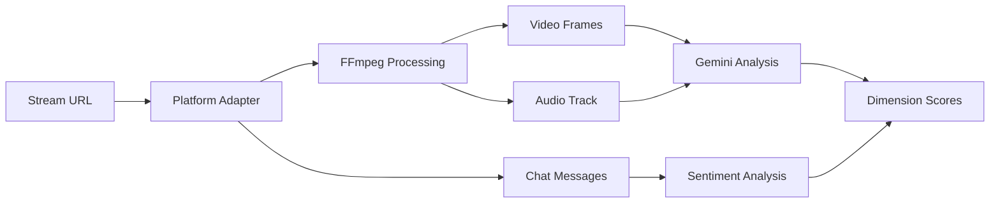

# AI-Powered Highlight Detection System

The TL;DR Highlight API uses advanced AI techniques to automatically identify the most engaging moments in video content through multi-modal analysis.

## 🧠 Overview

Our highlight detection system combines multiple AI approaches:

- **Google Gemini 2.0 Flash**: Multi-modal analysis of video, audio, and text
- **Custom Dimension Framework**: Configurable scoring criteria
- **Signal Fusion**: Combines multiple data sources for accurate detection
- **Post-Processing**: Refinement and ranking of detected highlights

## 🎯 Detection Pipeline

### 1. Content Ingestion


### 2. Multi-Modal Analysis

#### Video Analysis
- **Frame Extraction**: 1 FPS (configurable)
- **Scene Detection**: Automatic scene boundary detection
- **Visual Features**: Objects, actions, emotions, text recognition
- **Composition Analysis**: Camera angles, lighting, visual appeal

#### Audio Analysis  
- **Transcription**: Speech-to-text conversion
- **Tone Analysis**: Emotional tone and excitement detection
- **Music Detection**: Background music and sound effects
- **Volume Dynamics**: Energy level and intensity changes

#### Chat Analysis (when available)
- **Sentiment Analysis**: Real-time chat sentiment tracking
- **Engagement Metrics**: Message frequency and reaction patterns
- **Keyword Detection**: Important terms and phrases
- **Emotion Detection**: Excitement, confusion, appreciation

### 3. Dimension-Based Scoring

#### Gaming Preset Dimensions
```python
gaming_dimensions = [
    DimensionDefinition(
        name="action_intensity",
        description="Level of fast-paced action and movement",
        weight=1.2,
        examples=["combat sequences", "chase scenes", "boss battles"]
    ),
    DimensionDefinition(
        name="skill_display", 
        description="Demonstration of exceptional player skill",
        weight=1.0,
        examples=["perfect combos", "clutch plays", "trick shots"]
    ),
    DimensionDefinition(
        name="emotional_peaks",
        description="Moments of high emotional engagement",
        weight=0.8,
        examples=["victory celebrations", "close calls", "funny moments"]
    )
]
```

#### Educational Preset Dimensions
```python
education_dimensions = [
    DimensionDefinition(
        name="learning_moments",
        description="Key educational content delivery",
        weight=1.5,
        examples=["concept explanations", "problem solving", "demonstrations"]
    ),
    DimensionDefinition(
        name="engagement_peaks",
        description="High audience engagement periods", 
        weight=1.0,
        examples=["Q&A sessions", "interactive polls", "live demonstrations"]
    ),
    DimensionDefinition(
        name="key_concepts",
        description="Introduction of important concepts",
        weight=1.2,
        examples=["new terminology", "core principles", "case studies"]
    )
]
```

### 4. Signal Fusion Strategies

#### Weighted Average Fusion
```python
def weighted_fusion(video_score: float, audio_score: float, chat_score: float) -> float:
    """Combine multi-modal scores with configurable weights."""
    weights = {
        'video': 0.5,    # Primary signal
        'audio': 0.3,    # Secondary signal  
        'chat': 0.2      # Contextual signal
    }
    
    return (
        video_score * weights['video'] +
        audio_score * weights['audio'] + 
        chat_score * weights['chat']
    )
```

#### Consensus Fusion
```python
def consensus_fusion(scores: List[float], threshold: float = 0.7) -> float:
    """Require agreement across multiple modalities."""
    high_confidence_scores = [s for s in scores if s >= threshold]
    
    if len(high_confidence_scores) >= 2:  # Require 2+ modalities to agree
        return sum(high_confidence_scores) / len(high_confidence_scores)
    else:
        return max(scores) * 0.5  # Penalize disagreement
```

#### Cascade Fusion
```python
def cascade_fusion(video_score: float, audio_score: float, chat_score: float) -> float:
    """Use hierarchical decision making."""
    if video_score >= 0.8:  # High confidence video detection
        return video_score
    elif video_score >= 0.6 and audio_score >= 0.7:  # Medium confidence + audio support
        return (video_score * 0.7 + audio_score * 0.3)
    elif all(s >= 0.6 for s in [video_score, audio_score, chat_score]):  # Consensus
        return weighted_fusion(video_score, audio_score, chat_score)
    else:
        return max(video_score, audio_score, chat_score) * 0.6  # Single modality
```

## 🎛️ Configuration Options

### Processing Options
```python
@dataclass
class ProcessingOptions:
    # Modality Configuration
    enable_video_analysis: bool = True
    enable_audio_analysis: bool = True  
    enable_chat_analysis: bool = False
    
    # Analysis Parameters
    video_analysis_fps: int = 1
    audio_analysis_interval: int = 30  # seconds
    confidence_threshold: float = 0.7
    
    # Output Configuration
    max_highlights: Optional[int] = None
    min_highlight_duration: int = 5    # seconds
    max_highlight_duration: int = 300  # seconds
    
    # Fusion Strategy
    fusion_strategy: FusionStrategy = FusionStrategy.WEIGHTED
    modal_weights: Dict[str, float] = None
    
    # Performance
    processing_priority: ProcessingPriority = ProcessingPriority.NORMAL
    enable_parallel_processing: bool = True
```

### Custom Dimension Sets
```python
# Create organization-specific dimensions
custom_dimensions = DimensionSet(
    name="Corporate Meetings",
    description="Key moments in corporate presentations and meetings",
    dimensions=[
        DimensionDefinition(
            name="decision_moments",
            description="Important decisions being made",
            weight=1.5,
            prompt_template="Identify moments where important business decisions are discussed or made: {content}"
        ),
        DimensionDefinition(
            name="action_items", 
            description="Specific action items or next steps",
            weight=1.2,
            prompt_template="Find segments where specific action items or next steps are mentioned: {content}"
        ),
        DimensionDefinition(
            name="key_metrics",
            description="Important numbers, KPIs, or performance data",
            weight=1.0,
            prompt_template="Highlight moments where key metrics or performance data are presented: {content}"
        )
    ]
)
```

## 🔬 AI Model Integration

### Gemini 2.0 Flash Configuration
```python
class GeminiHighlightDetector:
    def __init__(self, api_key: str):
        self.client = genai.configure(api_key=api_key)
        self.model = genai.GenerativeModel('gemini-2.0-flash-exp')
        
    async def analyze_content(
        self,
        video_frames: List[bytes],
        audio_transcript: str,
        dimension_set: DimensionSet
    ) -> Dict[str, float]:
        """Analyze content against custom dimensions."""
        
        # Prepare multi-modal prompt
        prompt = self._build_analysis_prompt(dimension_set, audio_transcript)
        
        # Prepare content for analysis
        content = [prompt]
        for frame in video_frames:
            content.append({
                "mime_type": "image/jpeg",
                "data": frame
            })
        
        # Generate analysis
        response = await self.model.generate_content_async(content)
        
        # Parse dimension scores from response
        return self._parse_dimension_scores(response.text, dimension_set)
    
    def _build_analysis_prompt(
        self, 
        dimension_set: DimensionSet, 
        transcript: str
    ) -> str:
        """Build analysis prompt from dimension definitions."""
        prompt = f"""
        Analyze this video content and transcript for highlight detection.
        
        Transcript: {transcript}
        
        Score each dimension from 0.0 to 1.0 based on how well the content matches:
        
        """
        
        for dim in dimension_set.dimensions:
            prompt += f"""
        {dim.name}: {dim.description}
        Examples: {', '.join(dim.examples)}
        
        """
        
        prompt += """
        Return scores in JSON format:
        {
            "dimension_name": score,
            ...
        }
        """
        
        return prompt
```

### Analysis Strategies

#### AI-Only Strategy
```python
class AIAnalysisStrategy:
    """Pure AI-based analysis using language models."""
    
    async def analyze(
        self,
        content: MultiModalContent,
        dimension_set: DimensionSet
    ) -> AnalysisResult:
        # Use Gemini for all analysis
        scores = await self.gemini_detector.analyze_content(
            content.video_frames,
            content.audio_transcript,
            dimension_set
        )
        
        return AnalysisResult(
            dimension_scores=scores,
            confidence=self._calculate_confidence(scores),
            method="ai_only"
        )
```

#### Rule-Based Strategy  
```python
class RuleBasedAnalysisStrategy:
    """Deterministic rule-based analysis."""
    
    def __init__(self):
        self.rules = {
            "action_intensity": [
                KeywordRule(["fight", "battle", "combat"], weight=0.8),
                MotionRule(threshold=0.7, weight=0.6),
                AudioEnergyRule(threshold=0.8, weight=0.4)
            ],
            "emotional_peaks": [
                SentimentRule(sentiment="excitement", threshold=0.8),
                AudioToneRule(tone="celebration", threshold=0.7),
                ChatReactionRule(min_reactions=10, time_window=30)
            ]
        }
    
    async def analyze(
        self,
        content: MultiModalContent,
        dimension_set: DimensionSet
    ) -> AnalysisResult:
        scores = {}
        
        for dimension in dimension_set.dimensions:
            if dimension.name in self.rules:
                scores[dimension.name] = await self._apply_rules(
                    self.rules[dimension.name],
                    content
                )
            else:
                scores[dimension.name] = 0.0
        
        return AnalysisResult(
            dimension_scores=scores,
            confidence=0.9,  # High confidence in rule-based results
            method="rule_based"
        )
```

#### Hybrid Strategy
```python
class HybridAnalysisStrategy:
    """Combines AI and rule-based approaches."""
    
    def __init__(self):
        self.ai_strategy = AIAnalysisStrategy()
        self.rule_strategy = RuleBasedAnalysisStrategy()
    
    async def analyze(
        self,
        content: MultiModalContent,
        dimension_set: DimensionSet
    ) -> AnalysisResult:
        # Get both AI and rule-based analysis
        ai_result = await self.ai_strategy.analyze(content, dimension_set)
        rule_result = await self.rule_strategy.analyze(content, dimension_set)
        
        # Combine results with weighted average
        combined_scores = {}
        for dim_name in ai_result.dimension_scores:
            ai_score = ai_result.dimension_scores[dim_name]
            rule_score = rule_result.dimension_scores.get(dim_name, 0.0)
            
            # Weight AI higher but validate with rules
            combined_scores[dim_name] = (
                ai_score * 0.7 + rule_score * 0.3
            )
        
        return AnalysisResult(
            dimension_scores=combined_scores,
            confidence=(ai_result.confidence + rule_result.confidence) / 2,
            method="hybrid"
        )
```

## 📊 Performance Optimization

### Batch Processing
```python
class BatchAnalysisOptimizer:
    """Optimize AI analysis through batching."""
    
    async def process_batch(
        self,
        content_segments: List[ContentSegment],
        dimension_set: DimensionSet
    ) -> List[AnalysisResult]:
        # Group segments for batch processing
        batches = self._create_batches(content_segments, batch_size=10)
        
        results = []
        for batch in batches:
            # Process batch concurrently
            batch_results = await asyncio.gather(*[
                self._analyze_segment(segment, dimension_set)
                for segment in batch
            ])
            results.extend(batch_results)
        
        return results
```

### Caching Strategy
```python
class AnalysisCache:
    """Cache analysis results to avoid reprocessing."""
    
    def __init__(self, redis_client):
        self.redis = redis_client
        self.ttl = 86400  # 24 hours
    
    async def get_cached_analysis(
        self,
        content_hash: str,
        dimension_set_id: int
    ) -> Optional[AnalysisResult]:
        cache_key = f"analysis:{content_hash}:{dimension_set_id}"
        cached = await self.redis.get(cache_key)
        
        if cached:
            return AnalysisResult.from_json(cached)
        return None
    
    async def cache_analysis(
        self,
        content_hash: str,
        dimension_set_id: int,
        result: AnalysisResult
    ):
        cache_key = f"analysis:{content_hash}:{dimension_set_id}"
        await self.redis.setex(
            cache_key,
            self.ttl,
            result.to_json()
        )
```

## 🎯 Quality Assurance

### Confidence Calibration
```python
class ConfidenceCalibrator:
    """Calibrate confidence scores based on historical performance."""
    
    def __init__(self):
        self.calibration_data = self._load_calibration_data()
    
    def calibrate_score(
        self,
        raw_score: float,
        dimension: str,
        content_type: str
    ) -> float:
        """Adjust confidence based on historical accuracy."""
        calibration_factor = self.calibration_data.get(
            f"{dimension}_{content_type}",
            1.0
        )
        
        return min(raw_score * calibration_factor, 1.0)
```

### A/B Testing Framework
```python
class HighlightABTester:
    """Test different detection strategies and parameters."""
    
    async def run_experiment(
        self,
        content: MultiModalContent,
        control_config: ProcessingOptions,
        test_config: ProcessingOptions
    ) -> ABTestResult:
        # Run both configurations
        control_highlights = await self._detect_highlights(content, control_config)
        test_highlights = await self._detect_highlights(content, test_config)
        
        # Compare results
        return ABTestResult(
            control_count=len(control_highlights),
            test_count=len(test_highlights),
            overlap_ratio=self._calculate_overlap(control_highlights, test_highlights),
            quality_metrics=await self._evaluate_quality(control_highlights, test_highlights)
        )
```

## 📈 Analytics and Insights

### Detection Metrics
```python
@dataclass
class DetectionMetrics:
    total_processed: int
    highlights_detected: int
    average_confidence: float
    processing_time: float
    
    # Per-dimension metrics
    dimension_scores: Dict[str, float]
    dimension_usage: Dict[str, int]
    
    # Quality metrics
    false_positive_rate: Optional[float]
    false_negative_rate: Optional[float]
    user_feedback_score: Optional[float]
```

### Content Analysis Insights
```python
class ContentInsights:
    """Generate insights about processed content."""
    
    def analyze_trends(
        self,
        highlights: List[Highlight],
        time_window: timedelta = timedelta(days=30)
    ) -> TrendAnalysis:
        return TrendAnalysis(
            popular_dimensions=self._get_trending_dimensions(highlights),
            optimal_thresholds=self._calculate_optimal_thresholds(highlights),
            content_patterns=self._identify_patterns(highlights),
            performance_recommendations=self._generate_recommendations(highlights)
        )
```

---

This AI-powered highlight detection system provides flexible, accurate, and scalable content analysis that can be customized for any use case while maintaining high performance and quality standards.