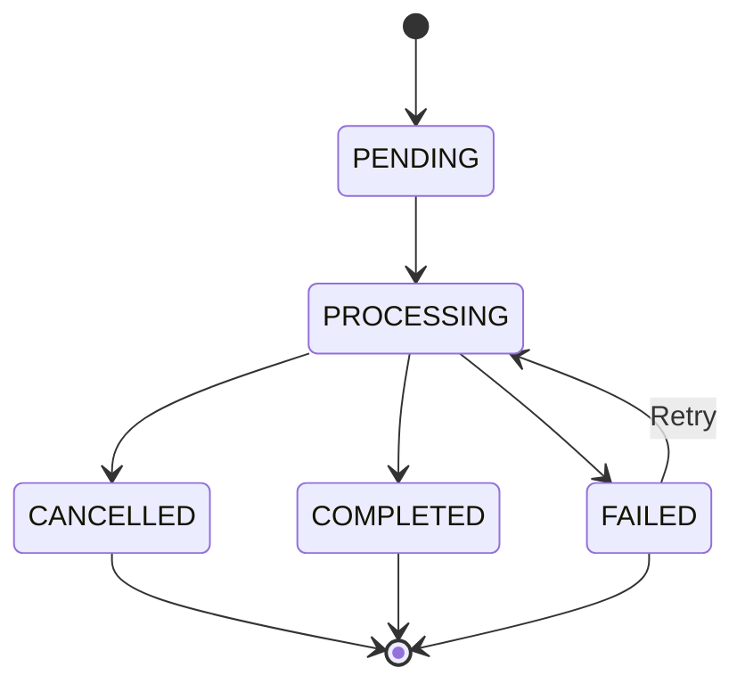

# Domain Model

This document describes the core domain model of the TL;DR Highlight API, following Domain-Driven Design (DDD) principles.

## 🎯 Domain Overview

The TL;DR Highlight API domain centers around **extracting meaningful highlights from livestreams and video content** using AI-powered analysis. The system serves multiple organizations with flexible, configurable highlight detection strategies.

### Core Domain Concepts

- **Organizations**: Multi-tenant entities with isolated processing
- **Streams**: Individual processing jobs for video content
- **Highlights**: AI-detected meaningful moments in content
- **Dimension Sets**: Configurable scoring frameworks
- **Processing Options**: Flexible analysis configuration
- **Webhooks**: Event-driven notifications

## 🏢 Bounded Contexts

### 1. Organization Management Context
Handles multi-tenant organization administration, user management, and subscription plans.

### 2. Stream Processing Context  
Manages the lifecycle of stream processing jobs from ingestion to completion.

### 3. Highlight Detection Context
AI-powered analysis and highlight extraction using configurable strategies.

### 4. Notification Context
Webhook delivery and event notification system.

### 5. Usage Tracking Context
Resource usage monitoring and analytics for billing and optimization.

## 📊 Core Entities

### Organization Entity

```python
class Organization:
    """Multi-tenant organization entity."""
    
    # Identity
    id: int
    name: CompanyName
    slug: str  # URL-friendly identifier
    
    # Metadata
    created_at: Timestamp
    updated_at: Timestamp
    
    # Configuration
    subscription_plan: SubscriptionPlan
    plan_limits: PlanLimits
    processing_settings: Dict[str, Any]
    
    # Relationships
    user_ids: List[int]
    dimension_set_ids: List[int]
    highlight_type_registry_ids: List[int]
```

**Business Rules:**
- Must have unique name and slug
- Subscription plan for reference only (no limits enforced)
- Processing settings isolated per organization
- Cannot be deleted if active streams exist

**Subscription Plans (for reference only - all plans have unlimited limits):**
- **Starter**: Basic features, unlimited processing
- **Professional**: Advanced features, unlimited processing  
- **Enterprise**: Full features, unlimited processing
- **Custom**: Tailored plans, unlimited processing

### Stream Entity

```python
class Stream:
    """Represents a stream processing job."""
    
    # Identity
    id: int
    
    # Source Information
    url: Url
    platform: Platform  # TWITCH, YOUTUBE, RTMP, CUSTOM
    title: Optional[str]
    
    # Processing Configuration
    processing_options: ProcessingOptions
    dimension_set_id: Optional[int]
    highlight_type_registry_id: Optional[int]
    
    # Status & Lifecycle
    status: StreamStatus
    created_at: Timestamp
    updated_at: Timestamp
    started_at: Optional[Timestamp]
    completed_at: Optional[Timestamp]
    
    # Results
    total_highlights: int
    processing_duration: Optional[Duration]
    error_message: Optional[str]
    
    # Relationships
    user_id: int
    organization_id: int
    highlight_ids: List[int]
```

**Stream Status Lifecycle:**


**Business Rules:**
- URL must be accessible and valid
- Processing options determine analysis strategy
- Status changes trigger webhook events
- Failed streams can be retried up to maximum attempts

### Highlight Entity

```python
class Highlight:
    """AI-detected highlight moment."""
    
    # Identity
    id: int
    
    # Content Information
    title: str
    description: Optional[str]
    stream_id: int
    
    # Timing
    timestamp: Timestamp
    duration: Duration
    start_time: float  # Seconds from stream start
    end_time: float
    
    # AI Analysis Results
    confidence_score: ConfidenceScore
    highlight_type: HighlightType
    dimension_scores: Dict[str, float]
    
    # Media Assets
    video_url: Optional[Url]
    thumbnail_url: Optional[Url]
    audio_url: Optional[Url]
    
    # Metadata
    created_at: Timestamp
    updated_at: Timestamp
    
    # Multi-Modal Analysis
    video_analysis: Optional[Dict[str, Any]]
    audio_analysis: Optional[Dict[str, Any]]
    chat_analysis: Optional[Dict[str, Any]]
    
    # Relationships
    organization_id: int
```

**Business Rules:**
- Must belong to a completed stream
- Confidence score determines visibility thresholds
- Duration must be within reasonable bounds (1s - 300s)
- Media URLs expire after configured time period

### Dimension Set Entity

```python
class DimensionSet:
    """Configurable scoring dimensions for content analysis."""
    
    # Identity
    id: int
    name: str
    description: Optional[str]
    
    # Configuration
    dimensions: List[DimensionDefinition]
    is_public: bool  # Available to all organizations
    is_active: bool
    
    # Metadata
    created_at: Timestamp
    updated_at: Timestamp
    
    # Relationships
    organization_id: Optional[int]  # None for public presets
    
    @property
    def dimension_count(self) -> int:
        return len(self.dimensions)
    
    def get_dimension(self, name: str) -> Optional[DimensionDefinition]:
        """Get dimension by name."""
        return next((d for d in self.dimensions if d.name == name), None)
```

**Industry Presets:**
- **Gaming**: action_intensity, skill_display, emotional_peaks
- **Education**: learning_moments, key_concepts, engagement_peaks  
- **Sports**: exciting_plays, scoring_moments, crowd_reactions
- **Corporate**: important_points, decision_moments, engagement_metrics

### Highlight Type Registry Entity

```python
class HighlightTypeRegistry:
    """Dynamic highlight type definitions per organization."""
    
    # Identity
    id: int
    name: str
    
    # Configuration
    highlight_types: List[HighlightTypeDefinition]
    default_type: str
    
    # Metadata
    created_at: Timestamp
    updated_at: Timestamp
    
    # Relationships
    organization_id: int
    
    def get_type_for_scores(self, scores: Dict[str, float]) -> str:
        """Determine highlight type based on dimension scores."""
        # Implementation of type assignment logic
        pass
```

### User Entity

```python
class User:
    """System user with organization membership."""
    
    # Identity
    id: int
    email: Email
    full_name: str
    
    # Authentication
    password_hash: str
    is_active: bool
    email_verified: bool
    
    # Membership
    organization_ids: List[int]
    role: UserRole  # ADMIN, MEMBER, VIEWER
    
    # Metadata
    created_at: Timestamp
    updated_at: Timestamp
    last_login_at: Optional[Timestamp]
```

### API Key Entity

```python
class APIKey:
    """API access credentials with scoped permissions."""
    
    # Identity
    id: int
    key_id: str  # Public identifier
    key_hash: str  # Hashed secret
    
    # Configuration
    name: str
    scopes: List[str]
    is_active: bool
    
    # Usage Tracking
    last_used_at: Optional[Timestamp]
    usage_count: int
    
    # Expiration
    expires_at: Optional[Timestamp]
    
    # Relationships
    user_id: int
    organization_id: int
    
    # Metadata
    created_at: Timestamp
    updated_at: Timestamp
```

### Webhook Entity

```python
class Webhook:
    """Event notification endpoint configuration."""
    
    # Identity
    id: int
    
    # Configuration
    url: Url
    events: List[WebhookEvent]
    secret: str  # For signature verification
    is_active: bool
    
    # Delivery Settings
    timeout_seconds: int
    max_retries: int
    retry_backoff: str  # exponential, linear
    
    # Metadata
    created_at: Timestamp
    updated_at: Timestamp
    
    # Relationships
    organization_id: int
```

## 🎨 Value Objects

### Timestamp

```python
class Timestamp:
    """Immutable timestamp with timezone awareness."""
    
    def __init__(self, dt: datetime):
        self._dt = dt.replace(tzinfo=timezone.utc)
    
    @classmethod
    def now(cls) -> 'Timestamp':
        return cls(datetime.now(timezone.utc))
    
    @property
    def iso_string(self) -> str:
        return self._dt.isoformat()
    
    def __eq__(self, other) -> bool:
        return isinstance(other, Timestamp) and self._dt == other._dt
```

### Duration

```python
class Duration:
    """Immutable duration representation."""
    
    def __init__(self, seconds: float):
        if seconds < 0:
            raise ValueError("Duration cannot be negative")
        self._seconds = seconds
    
    @property
    def seconds(self) -> float:
        return self._seconds
    
    @property
    def minutes(self) -> float:
        return self._seconds / 60
    
    def to_timecode(self) -> str:
        """Convert to HH:MM:SS format."""
        hours = int(self._seconds // 3600)
        minutes = int((self._seconds % 3600) // 60)
        seconds = int(self._seconds % 60)
        return f"{hours:02d}:{minutes:02d}:{seconds:02d}"
```

### ConfidenceScore

```python
class ConfidenceScore:
    """Normalized confidence value between 0.0 and 1.0."""
    
    def __init__(self, value: float):
        if not 0.0 <= value <= 1.0:
            raise ValueError("Confidence score must be between 0.0 and 1.0")
        self._value = value
    
    @property
    def value(self) -> float:
        return self._value
    
    @property
    def percentage(self) -> int:
        return int(self._value * 100)
    
    def is_high(self, threshold: float = 0.8) -> bool:
        return self._value >= threshold
```

### DimensionDefinition

```python
class DimensionDefinition:
    """Defines a scoring dimension for content analysis."""
    
    def __init__(
        self,
        name: str,
        description: str,
        dimension_type: DimensionType,  # NUMERIC, BINARY, CATEGORICAL
        weight: float = 1.0,
        prompt_template: Optional[PromptTemplate] = None,
        examples: Optional[List[str]] = None
    ):
        self.name = name
        self.description = description
        self.dimension_type = dimension_type
        self.weight = weight
        self.prompt_template = prompt_template
        self.examples = examples or []
    
    def generate_prompt(self, content: str) -> str:
        """Generate AI analysis prompt for this dimension."""
        if self.prompt_template:
            return self.prompt_template.format(
                dimension_name=self.name,
                description=self.description,
                content=content,
                examples="\n".join(self.examples)
            )
        return f"Analyze the {self.name} of this content: {content}"
```

### ProcessingOptions

```python
class ProcessingOptions:
    """Configuration for stream processing."""
    
    def __init__(
        self,
        enable_video_analysis: bool = True,
        enable_audio_analysis: bool = True,
        enable_chat_analysis: bool = False,
        video_analysis_fps: int = 1,
        audio_analysis_interval: int = 30,
        confidence_threshold: float = 0.7,
        max_highlights: Optional[int] = None,
        processing_priority: ProcessingPriority = ProcessingPriority.NORMAL
    ):
        self.enable_video_analysis = enable_video_analysis
        self.enable_audio_analysis = enable_audio_analysis
        self.enable_chat_analysis = enable_chat_analysis
        self.video_analysis_fps = video_analysis_fps
        self.audio_analysis_interval = audio_analysis_interval
        self.confidence_threshold = confidence_threshold
        self.max_highlights = max_highlights
        self.processing_priority = processing_priority
```

## 🔄 Domain Services

### StreamProcessingService

```python
class StreamProcessingService:
    """Orchestrates end-to-end stream processing."""
    
    async def process_stream(
        self,
        stream: Stream,
        processing_options: ProcessingOptions
    ) -> StreamProcessingResult:
        """Process a stream through the complete pipeline."""
        
        # 1. Validate stream and options
        self._validate_stream(stream)
        self._validate_processing_options(processing_options)
        
        # 2. Initialize processing
        await self._initialize_processing(stream)
        
        # 3. Content ingestion
        content = await self._ingest_content(stream)
        
        # 4. Multi-modal analysis
        analysis_results = await self._analyze_content(content, processing_options)
        
        # 5. Highlight detection
        highlights = await self._detect_highlights(analysis_results, stream)
        
        # 6. Post-processing
        processed_highlights = await self._post_process_highlights(highlights)
        
        # 7. Storage and finalization
        await self._store_results(stream, processed_highlights)
        
        return StreamProcessingResult(
            stream=stream,
            highlights=processed_highlights,
            processing_duration=Duration(time.time() - start_time)
        )
```

### HighlightDetectionService

```python
class HighlightDetectionService:
    """AI-powered highlight detection and scoring."""
    
    async def detect_highlights(
        self,
        content: MultiModalContent,
        dimension_set: DimensionSet,
        options: ProcessingOptions
    ) -> List[Highlight]:
        """Detect highlights using configured dimensions."""
        
        # 1. Score content against dimensions
        dimension_scores = await self._score_dimensions(content, dimension_set)
        
        # 2. Apply fusion strategy
        fused_scores = await self._fuse_modal_scores(dimension_scores)
        
        # 3. Identify highlight candidates
        candidates = await self._identify_candidates(fused_scores, options)
        
        # 4. Rank and filter
        final_highlights = await self._rank_and_filter(candidates, options)
        
        return final_highlights
```

### OrganizationManagementService

```python
class OrganizationManagementService:
    """Organization lifecycle and membership management."""
    
    async def create_organization(
        self,
        name: str,
        admin_user: User,
        subscription_plan: SubscriptionPlan
    ) -> Organization:
        """Create new organization with admin user."""
        
        # 1. Validate organization name uniqueness
        await self._validate_organization_name(name)
        
        # 2. Create organization
        org = Organization(
            name=CompanyName(name),
            slug=self._generate_slug(name),
            subscription_plan=subscription_plan,
            plan_limits=self._get_plan_limits(subscription_plan),
            user_ids=[admin_user.id],
            created_at=Timestamp.now(),
            updated_at=Timestamp.now()
        )
        
        # 3. Set up default dimension sets
        await self._create_default_dimension_sets(org)
        
        # 4. Set up default highlight type registry
        await self._create_default_highlight_types(org)
        
        return await self.org_repo.create(org)
```

## 📋 Repository Interfaces

### StreamRepository

```python
class StreamRepository(ABC):
    """Repository interface for stream persistence."""
    
    @abstractmethod
    async def create(self, stream: Stream) -> Stream:
        """Create a new stream."""
        pass
    
    @abstractmethod
    async def get_by_id(self, stream_id: int) -> Optional[Stream]:
        """Get stream by ID."""
        pass
    
    @abstractmethod
    async def get_by_organization(
        self,
        organization_id: int,
        status: Optional[StreamStatus] = None,
        limit: int = 100,
        offset: int = 0
    ) -> List[Stream]:
        """Get streams for organization with optional filtering."""
        pass
    
    @abstractmethod
    async def update_status(
        self,
        stream_id: int,
        status: StreamStatus,
        error_message: Optional[str] = None
    ) -> None:
        """Update stream status."""
        pass
```

### HighlightRepository

```python
class HighlightRepository(ABC):
    """Repository interface for highlight persistence."""
    
    @abstractmethod
    async def create_batch(self, highlights: List[Highlight]) -> List[Highlight]:
        """Create multiple highlights efficiently."""
        pass
    
    @abstractmethod
    async def get_by_stream(
        self,
        stream_id: int,
        confidence_threshold: Optional[float] = None
    ) -> List[Highlight]:
        """Get highlights for a stream."""
        pass
    
    @abstractmethod
    async def search(
        self,
        organization_id: int,
        query: HighlightSearchQuery
    ) -> List[Highlight]:
        """Search highlights with filters."""
        pass
```

## ⚡ Domain Events

### Stream Events

```python
class StreamCreated(DomainEvent):
    stream_id: int
    organization_id: int
    url: str
    created_at: Timestamp

class StreamProcessingStarted(DomainEvent):
    stream_id: int
    started_at: Timestamp

class StreamProcessingCompleted(DomainEvent):
    stream_id: int
    completed_at: Timestamp
    highlights_count: int
    processing_duration: Duration

class StreamProcessingFailed(DomainEvent):
    stream_id: int
    failed_at: Timestamp
    error_message: str
```

### Highlight Events

```python
class HighlightDetected(DomainEvent):
    highlight_id: int
    stream_id: int
    confidence_score: float
    highlight_type: str
    detected_at: Timestamp

class HighlightsProcessed(DomainEvent):
    stream_id: int
    highlight_ids: List[int]
    processed_at: Timestamp
```

## 🔒 Business Rules and Invariants

### Organization Rules
- Organization names must be unique globally
- Each organization must have at least one admin user
- Subscription plan changes require admin approval
- Processing limits enforced per subscription tier

### Stream Rules
- Stream URLs must be accessible when processing starts
- Only one active processing job per unique URL per organization
- Failed streams can be retried maximum 3 times
- Processing timeout based on subscription plan limits

### Highlight Rules
- Highlights must have confidence score ≥ configured threshold
- Duration must be between 1 second and 5 minutes
- Maximum 1000 highlights per stream (configurable)
- Highlights auto-expire based on storage plan

### Security Rules
- API keys scoped to single organization
- Webhook secrets must be cryptographically secure
- User sessions expire after configurable timeout
- All domain operations require proper authorization

## 📈 Aggregates and Consistency

### Stream Aggregate
- **Aggregate Root**: Stream
- **Consistency Boundary**: Stream + its Highlights
- **Business Logic**: Status transitions, highlight validation
- **Events**: Status changes, highlight detection

### Organization Aggregate  
- **Aggregate Root**: Organization
- **Consistency Boundary**: Organization + Users + Settings
- **Business Logic**: Membership management, plan limits
- **Events**: Member changes, plan upgrades

### Processing Aggregate
- **Aggregate Root**: Stream
- **Consistency Boundary**: Stream + Processing Job + Results
- **Business Logic**: Processing pipeline, resource allocation
- **Events**: Processing lifecycle events

---

This domain model provides a solid foundation for the TL;DR Highlight API, ensuring clear separation of concerns, business rule enforcement, and scalable architecture patterns.