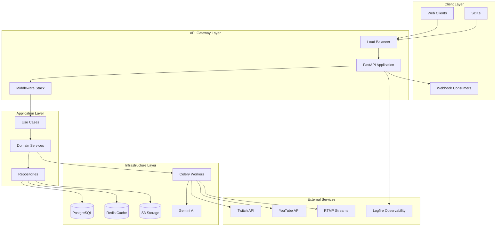
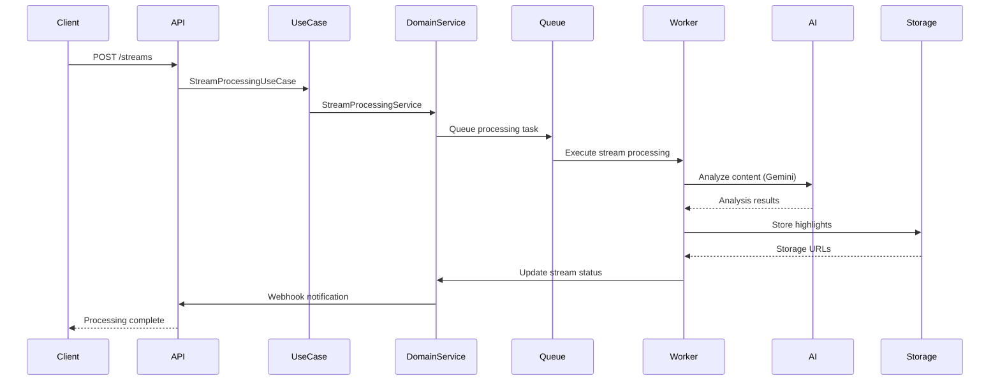
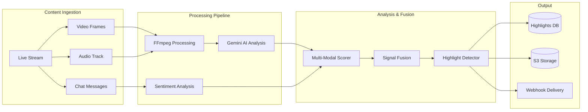
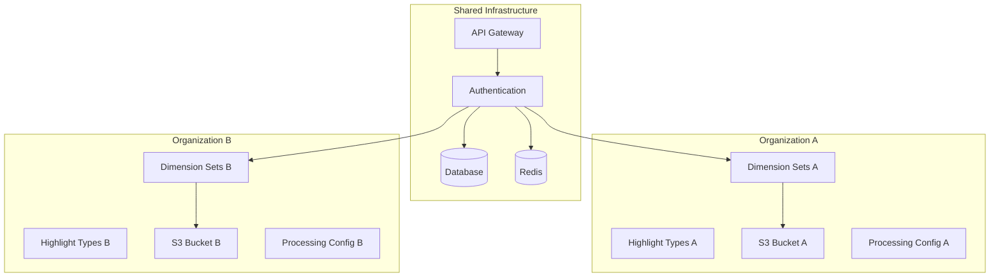

# Architecture Overview

The TL;DR Highlight API is built using modern software architecture principles with a focus on scalability, maintainability, and enterprise-grade reliability.

## 🏗️ High-Level Architecture

## 🎯 Architectural Principles

### Domain-Driven Design (DDD)
- **Entities**: Core business objects with identity (Stream, Highlight, Organization)
- **Value Objects**: Immutable objects (Timestamp, Duration, ConfidenceScore)
- **Aggregates**: Consistency boundaries around related entities
- **Domain Services**: Complex business logic that doesn't belong to a single entity
- **Repositories**: Data access abstractions

### Hexagonal Architecture (Ports & Adapters)
- **Core Domain**: Pure business logic without infrastructure dependencies
- **Application Services**: Orchestrate domain operations
- **Adapters**: Interface with external systems (databases, APIs, file systems)
- **Ports**: Define contracts between layers

### Clean Architecture Layers

#### 1. Domain Layer (`src/domain/`)
**The Core Business Logic**
- **Entities**: Stream, Highlight, Organization, User, Webhook
- **Value Objects**: Timestamp, Duration, URL, ConfidenceScore
- **Domain Services**: Complex business operations
- **Repository Interfaces**: Data access contracts
- **Domain Exceptions**: Business rule violations

**Key Characteristics:**
- No dependencies on infrastructure
- Contains all business rules and invariants
- Framework-independent
- Highly testable

#### 2. Application Layer (`src/application/`)
**Use Case Orchestration**
- **Use Cases**: Application-specific business rules
- **DTOs**: Data transfer objects for use case boundaries
- **Application Services**: Coordinate domain operations

**Key Characteristics:**
- Depends only on domain layer
- Orchestrates domain operations
- Handles application-specific workflows
- Transaction boundaries

#### 3. Infrastructure Layer (`src/infrastructure/`)
**External Integrations and Technical Concerns**
- **Database**: PostgreSQL with SQLAlchemy
- **Caching**: Redis for performance and rate limiting
- **Storage**: S3 for file storage
- **Queue**: Celery for async processing
- **AI Integration**: Google Gemini for content analysis
- **Monitoring**: Logfire for observability

#### 4. API Layer (`src/api/`)
**External Interface**
- **REST Controllers**: FastAPI routers
- **DTOs**: Request/response models
- **Middleware**: Cross-cutting concerns
- **Exception Handlers**: Error management

## 🔄 Data Flow Architecture

### Stream Processing Pipeline

### Multi-Modal Analysis Flow

## 🏢 Multi-Tenant Architecture

### Organization Isolation

**Key Isolation Mechanisms:**
- Database-level tenant isolation with organization_id filtering
- Separate S3 buckets per organization
- Tenant-specific dimension sets and highlight type registries
- Isolated processing configurations and quotas
- API key scoping to organizations

## 🚀 Scalability Patterns

### Horizontal Scaling
- **Stateless API**: Multiple API instances behind load balancer
- **Worker Scaling**: Multiple Celery workers for parallel processing
- **Database Scaling**: Read replicas and connection pooling
- **Cache Scaling**: Redis cluster for distributed caching

### Performance Optimizations
- **Async Processing**: Non-blocking I/O throughout the stack
- **Connection Pooling**: Database and Redis connection reuse
- **Caching Strategy**: Multi-layer caching (Redis, CDN)
- **Batch Processing**: Efficient bulk operations

### Resource Management
- **Queue Prioritization**: Different priority levels for customer tiers
- **Rate Limiting**: Per-organization API quotas
- **Resource Quotas**: Processing limits per subscription plan
- **Circuit Breakers**: Fault tolerance for external services

## 🔒 Security Architecture

### Authentication & Authorization
- **API Key Authentication**: Secure key-based access
- **JWT Tokens**: Stateless session management
- **Scoped Permissions**: Fine-grained access control
- **Organization Isolation**: Multi-tenant security

### Data Security
- **Encryption at Rest**: Database and file storage encryption
- **Encryption in Transit**: TLS for all communications
- **Webhook Security**: HMAC signature validation
- **Input Validation**: Comprehensive request validation

### Infrastructure Security
- **Network Isolation**: VPC and security groups
- **Secrets Management**: Encrypted configuration storage
- **Audit Logging**: Comprehensive activity tracking
- **Security Headers**: HTTP security headers

## 📊 Observability Architecture

### Monitoring Stack
- **Logfire Integration**: Comprehensive application monitoring
- **Distributed Tracing**: Request flow tracking
- **Custom Metrics**: Business and technical metrics
- **Health Checks**: Service availability monitoring

### Logging Strategy
- **Structured Logging**: JSON-formatted logs
- **Correlation IDs**: Request tracking across services
- **Log Aggregation**: Centralized log collection
- **Alerting**: Automated incident detection

## 🔧 Technology Stack

### Core Technologies
- **Python 3.11+**: Modern Python with async support
- **FastAPI**: High-performance web framework
- **SQLAlchemy 2.0**: Modern ORM with async support
- **Celery**: Distributed task queue
- **Redis**: Caching and message broker
- **PostgreSQL**: Primary data store

### AI & Media Processing
- **Google Gemini**: Multi-modal AI analysis
- **FFmpeg**: Video and audio processing
- **OpenCV**: Computer vision operations
- **scikit-learn**: Machine learning utilities

### Infrastructure & Deployment
- **Docker**: Containerization
- **AWS S3**: File storage
- **Logfire**: Observability platform
- **Alembic**: Database migrations

## 📈 Performance Characteristics

### Response Times (SLA)
- **API Endpoints**: < 200ms (95th percentile)
- **Stream Processing**: < 5 minutes for 30-minute stream
- **Webhook Delivery**: < 1 second
- **Highlight Detection**: < 2 minutes per highlight

### Throughput
- **Concurrent Streams**: 100+ simultaneous processing jobs
- **API Requests**: 10,000+ requests per minute
- **Highlight Generation**: 1,000+ highlights per hour
- **Storage Operations**: 50+ GB per hour

### Reliability
- **Uptime SLA**: 99.9% availability
- **Data Durability**: 99.999999999% (S3)
- **Processing Success Rate**: 99.5%
- **Webhook Delivery**: 99.9% success rate

## 🔮 Future Architecture Considerations

### Scalability Enhancements
- **Microservices Migration**: Breaking down monolith into focused services
- **Event Sourcing**: Audit trail and state reconstruction
- **CQRS**: Command-Query Responsibility Segregation
- **GraphQL**: Flexible API query interface

### AI/ML Improvements
- **Model Serving**: Dedicated ML model serving infrastructure
- **Real-Time Inference**: Sub-second AI analysis
- **Custom Models**: Organization-specific trained models
- **Edge Processing**: Distributed AI processing

### Infrastructure Evolution
- **Kubernetes**: Container orchestration
- **Service Mesh**: Advanced networking and security
- **Multi-Region**: Geographic distribution
- **Auto-Scaling**: Dynamic resource allocation

---

This architecture provides a solid foundation for enterprise-scale operations while maintaining flexibility for future growth and evolution.